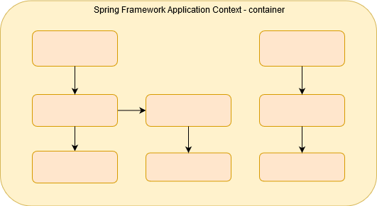
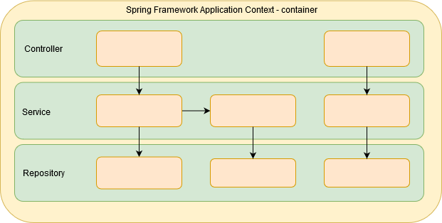
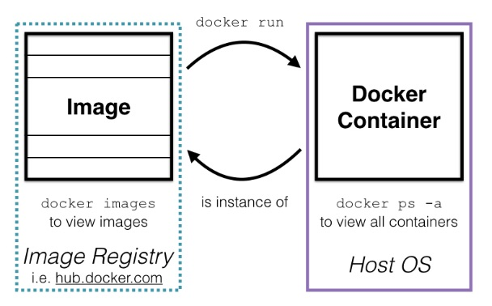
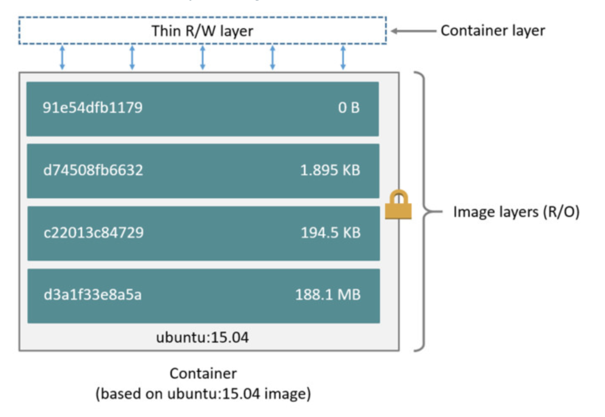
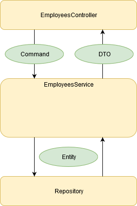
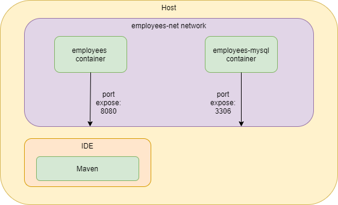
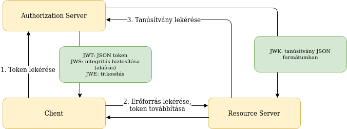
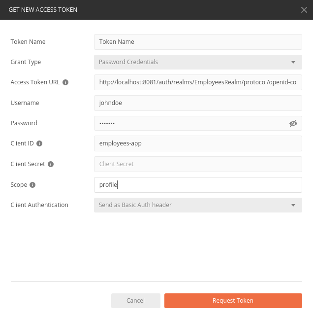
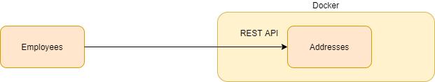
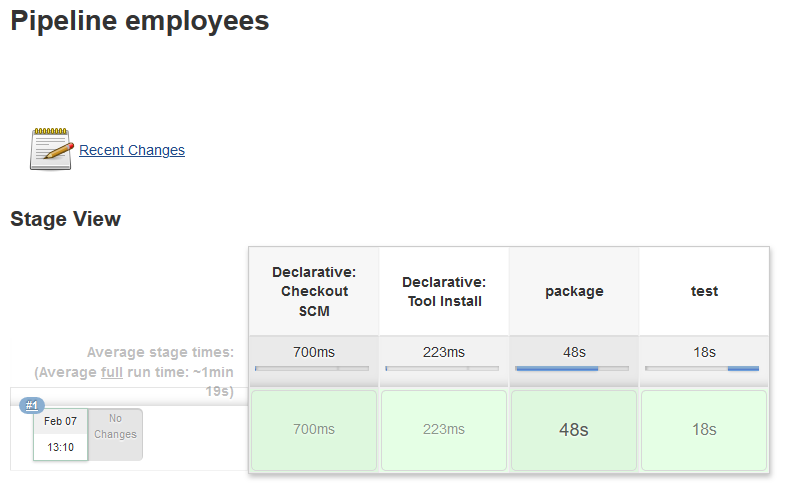

class: inverse, center, middle

# Microservice alkalmazás felépítése Spring Boot keretrendszerrel Docker környezetben

---

class: inverse, center, middle

# Bevezetés

---

## Referenciák

* Craig Walls: Spring in Action, Fifth Edition (Manning)
* Kevin Hoffman: Beyond the Twelve-Factor App (O'Reilly)
* [Spring Boot Reference Documentation](https://docs.spring.io/spring-boot/docs/current/reference/htmlsingle/)

---

class: inverse, center, middle

# Bevezetés a Spring Framework használatába

---

## Spring Framework céljai

* Keretrendszer nagyvállalati alkalmazásfejlesztésre
* Keretrendszer: komponensek hívása, életciklusa
* Nagyvállalati alkalmazás: Java SE által nem támogatott tulajdonságok
    * Spring Framework nem magában ad választ, hanem integrál egy vagy <br /> több megoldást

---

## Nagyvállalati alkalmazás - 1.

* Komponensek életciklus kezelése és kapcsolatok
* Távoli elérés
* Többszálúság
* Perzisztencia
* Tranzakció-kezelés
* Aszinkron üzenetkezelés
* Ütemezés

---

## Nagyvállalati alkalmazás - 2.

* Integráció
* Auditálhatóság
* Konfigurálhatóság
* Naplózás, monitorozás és beavatkozás
* Biztonság
* Tesztelhetőség

---

## Spring Framework <br /> tulajdonságai - 1.

* Komponensek, melyeket konténerként tartalmaz <br /> (konténer: Application Context)
* Konténer vezérli a komponensek életciklusát <br /> (pl. példányosítás)
* Konténer felügyeli a komponensek közötti kapcsolatot <br /> (Dependency Injection, Inversion of Control)
* Komponensek és kapcsolataik leírása több módon: <br /> XML, annotáció, Java kód
* Pehelysúlyú, non invasive (POJO komponensek)
* Aspektusorientált programozás támogatása

---

## Spring Framework <br /> tulajdonságai - 2.

* 3rd party library-k integrálása az egységes modellbe
* Glue kód
* Boilerplate kódok eliminálása
* Fejlesztők az üzleti problémák <br /> megoldására koncentráljanak

---

## Application Context



---

## Háromrétegű webes alkalmazás

* Nem kizárólag erre, de ez a fő felhasználási terület
* Rétegek
    * Repository
    * Service
    * Controller
* Hangsúlyos része a Spring MVC webes alkalmazások írására, <br /> HTTP felé egy absztrakció
* HTTP kezelését web konténerre bízza, <br /> pl. Tomcat, Jetty, stb.

---

## Rétegek



---

class: inverse, center, middle

# Bevezetés a Spring Boot használatába

---

## Spring Boot - 1.

* Autoconfiguration: classpath-on lévő osztályok, 3rd party library-k, környezeti változók és
  egyéb körülmények alapján komponensek automatikus <br /> létrehozása és konfigurálása
* Intelligens alapértékek, convention over configuration, <br /> konfiguráció nélkül is működjön
    * Saját konfiguráció írása csak akkor, ha eltérnénk az alapértelmezettől
    * Automatically, automagically
* Self-contained: az alkalmazás tartalmazza <br /> a web konténert is (pl. Tomcat)

---

## Spring Boot - 2.

* Nagyvállalati üzemeltethetőség: Actuatorok
    * Pl. monitorozás, konfiguráció, beavatkozás, <br /> naplózás állítása, stb.
* Gyors kezdés: Spring Initializr [https://start.spring.io/](https://start.spring.io/)
* Starter projektek: függőségek, <br /> előre beállított verziószámokkal (tesztelt)
* Ezért különösen alkalmas microservice-ek fejlesztésére

---

## Könyvtárstruktúra

```shell
├── .gitignore
├── .mvn
├── HELP.md
├── mvnw
├── mvnw.cmd
├── pom.xml
└── src
    ├── main
    │   ├── java
    │   │   └── training
    │   │       └── employees
    │   │           └── EmployeesApplication.java
    │   └── resources
    │       ├── application.properties
    │       ├── static
    │       └── templates
    └── test
        └── java
            └── training
                └── employees
                    └── EmployeesApplicationTests.java
```

---

## pom.xml

* Parent: `org.springframework.boot:spring-boot-starter-parent`
    * Innen öröklődnek a függőségek, verziókkal együtt
* Starter: `org.springframework.boot:spring-boot-starter-web`
    * Jackson, Tomcat
* Teszt támogatás: `org.springframework.boot:spring-boot-starter-test`
    * JUnit 5, Mockito, AssertJ, Hamcrest, [XMLUnit](https://www.xmlunit.org/), [JSONassert](https://github.com/skyscreamer/JSONassert), [JsonPath](https://github.com/json-path/JsonPath)

---

class: inverse, center, middle

# Spring Beanek

---

## Spring Beanek

* Spring bean: tud róla a Spring konténer
* Spring példányosítja
* Spring állítja be a függőségeit
* POJO
* Rétegekbe rendezve
* Alapértelmezetten singleton, egy példányban jön létre

---

## Application

* Alkalmazás belépési pontja `main()` metódussal
* `@SpringBootApplication`:
    * `@EnableAutoConfiguration`: autoconfiguration bekapcsolása
    * `@SpringBootConfiguration`: `@Configuration`: maga az osztály is <br /> tartalmazhasson további konfigurációkat
    * `@ComponentScan`: `@Component`, <br /> `@Repository`, `@Service`, `@Controller`
    annotációval ellátott

```java
@SpringBootApplication
public class EmployeesApplication {

  public static void main(String[] args) {
    SpringApplication.run(EmployeesApplication.class,
      args);
  }

}
```

---

## Controller komponensek

* Spring MVC része
* Felhasználóhoz legközelebb lévő réteg, felelős a <br /> felhasználóval való
  kapcsolattartásért
    * Adatmegjelenítés és adatbekérés
* POJO
* Annotációk erős használata
* Nem feltétlenül van Servlet API függősége
* Metódusok neve, paraméterezése flexibilis
* Gyakran REST végpontok kialakítására használjuk

---

## Annotációk

* `@Controller`: megtalálja a component scan, Spring MVC felismeri
* `@RequestMapping` milyen URL-en hallgat
    * Ant-szerű megadási mód (pl. `/admin/*.html`)
    * Megadható a HTTP metódus a `method` paraméterrel
* `@ResponseBody` visszatérési értékét azonnal a HTTP válaszba kell írni <br /> (valamilyen szerializáció után)

---

## Controller

```java
@Controller
public class EmployeesController {

    @RequestMapping("/")
    @ResponseBody
    public String helloWorld() {
        return "Hello World!";
    }
}
```

---

## Service

```java
@Service
public class EmployeesService {

    public String helloWorld() {
        return "Hello World at " + LocalDateTime.now();
    }
}
```

---

## Kapcsolatok

* Dependency injection
* Definiáljuk a függőséget, a konténer állítja be
* Függőségek definiálása:
    * Attribútum
    * Konstruktor
    * Metódus
* Legjobb gyakorlat: kötelező függőség konstruktorban
* Ha csak egy konstruktor, automatikusan megtörténik <br /> a dependency injection
* Egyéb esetben `@Autowired` annotáció

---

## Függőség a controllerben

```java
@Controller
public class EmployeesController {

    public final EmployeesService employeesService;

    public EmployeesController(EmployeesService employeesService) {
        this.employeesService = employeesService;
    }

    @RequestMapping("/")
    @ResponseBody
    public String helloWorld() {
        return employeesService.helloWorld();
    }
}
```

---

class: inverse, center, middle

# Statikus állományok

---

## Statikus állomány

* `src/main/resources/static` könyvtárban
* Welcome Page: `index.html`

---

## WebJars

* JavaScript könyvtárak jar fájlba csomagolva
* `META-INF/resources` könyvtárban
* Hivatkozás pl.: `/webjars/bootstrap/4.5.2/css/bootstrap.css`

```xml
<dependency>
    <groupId>org.webjars</groupId>
    <artifactId>bootstrap</artifactId>
    <version>4.5.2</version>
</dependency>
```

---

## Version agnostic

Hivatkozás pl.: `/webjars/bootstrap/css/bootstrap.css`

```xml
<dependency>
    <groupId>org.webjars</groupId>
    <artifactId>webjars-locator-core</artifactId>
</dependency>
```

---

class: inverse, center, middle

# Konfiguráció Javaban

---

## Java konfiguráció

* Ekkor nem kell a `@Service` annotáció: non-invasive
* `@Configuration` által ellátott osztályban, itt `EmployeesApplication`
* Legjobb gyakorlat: saját beanek component scannel, <br /> 3rd party library-k Java konfiggal
* Legjobb gyakorlat: rétegenként külön `@Configuration` <br /> annotációval ellátott osztály

---

## Java konfiguráció példa

```java
@Bean
public EmployeesService employeesService() {
  return new EmployeesService();
}
```

```java
public class EmployeesService {

    public String helloWorld() {
        return "Hello Dev Tools at " + LocalDateTime.now();
    }
}
```

---

class: inverse, center, middle

# Build és futtatás Mavennel

---

## Build parancssorból

* Build parancssorból Mavennel

```shell
mvnw clean package
```

* `spring-boot-maven-plugin`: átcsomagolás, beágyazza a web konténert
* `employees-0.0.1-SNAPSHOT.jar.original` és <br /> `employees-0.0.1-SNAPSHOT.jar`

---

## Futtatás parancssorból

* Futtatás parancssorból Mavennel

```shell
mvnw spring-boot:run
```

* Futtatás parancssorból

```shell
java -jar employees-0.0.1-SNAPSHOT.jar
```

---

class: inverse, center, middle

# Build és futtatás Gradle használatával

---

## Gradle használata

* A [start.spring.io](https://start.spring.io) támogatja a Gradle alapú projekt generálását
* A [io.spring.dependency-management](https://docs.spring.io/dependency-management-plugin/docs/current/reference/html/)
  Gradle plugin <br /> lehetővé tesz Maven-szerű
  függőségkezelést <br /> - csak a verziókat deklarálja, de a függőséget explicit kell megadni
* A [org.springframework.boot](https://docs.spring.io/spring-boot/docs/current/gradle-plugin/reference/html/#reacting-to-other-plugins-dependency-management)
  Gradle plugin <br /> képes a jar és war előállítására, figyelembe véve az előző plugint
* Generál Gradle wrappert is - ha nincs Gradle telepítve az adott gépre
* JUnit 5 függőség

---

## Gradle taskok

```shell
gradle build

gradle -i build

gradle bootRun
```

A `-i` kapcsoló INFO szintű naplózást állít

---

class: inverse, center, middle

# Unit és integrációs tesztek

---

## Unit tesztelés

* JUnit 5
* Non invasive - POJO-ként tesztelhető
* AssertJ, Hamcrest classpath-on

```java
@Test
void testSayHello() {
  EmployeesService employeesService = new EmployeesService();
  assertThat(employeesService.sayHello())
    .startsWith("Hello");
}
```

---

## Unit tesztelés függőséggel

* Mockito classpath-on

```java
@ExtendWith(MockitoExtension.class)
public class EmployeesControllerTest {

  @Mock
  EmployeesService employeesService;

  @InjectMocks
  EmployeesController employeesController;

  @Test
  void testSayHello() {
    when(employeesService.sayHello())
      .thenReturn("Hello Mock");
    assertThat(employeesController.helloWorld())
      .startsWith("Hello Mock");
  }
}
```

---

## Integrációs tesztek

* Üres teszt a konfiguráció ellenőrzésére, elindul-e az application context
* `@SpringBootTest` annotáció: tartalmazza <br /> az `@ExtendWith(SpringExtension.class)` annotációt
* Tesztesetek között cache-eli az application contextet
* Beanek injektálhatóak az `@Autowired` annotációval

---

## Integrációs tesztek példa

```java
@SpringBootTest
public class EmployeesControllerIT {

  @Autowired
  EmployeesController employeesController;

  @Test
  void testSayHello() {
    String message = employeesController
      .helloWorld();
    assertThat(message).startsWith("Hello");
  }
}
```

---

class: inverse, center, middle

# Developer Tools

---

## Developer Tools

* Felülírt property-k (Property Defaults): pl. template cache kikapcsolása
* Automatikus újraindítás
* LiveReload
* Globális, felhasználónkénti beállítások (Global Settings)
* Távoli alkalmazáson osztály frissítése (Remote Applications)


```xml
<dependency>
  <groupId>org.springframework.boot</groupId>
  <artifactId>spring-boot-devtools</artifactId>
</dependency>
```

---

## Automatikus újraindítás

* Ha változik valami a classpath-on
* IDE függő
    * Eclipse-nél mentésre
    * IDEA-nál _Build / Rebuild Project_ (`Ctrl + F9` billentyűzetkombináció)
* Két osztálybetöltő, az egyik a saját kód, másik a függőségek - <br /> változás esetén csak az elsőt tölti újra, függőség változása esetén <br /> manuálisan kell újraindítani
* Újraindítja a web konténert is

```properties
spring.devtools.restart.poll-interval=2s
spring.devtools.restart.quiet-period=1s
```

---

## LiveReload

* Böngésző plugin szükséges hozzá
* A Spring Boot elindít egy LiveReload szervert
* LiveReload plugin felépít egy WebSocket kapcsolatot
* Ha változik valami, újratöltés van
* Pl. statikus állomány esetén (`src/main/resources/static/*.html`)
* IDE függő
    * Eclipse-nél mentésre
    * IDEA-nál _Build / Rebuild Project_ <br /> (`Ctrl + F9` billentyűzetkombináció)

---

## Global settings

* `$HOME/.config/spring-boot` könyvtárban <br /> pl. `spring-boot-devtools.properties` állomány

---

## Remote Applications

* El lehet indítani becsomagolt alkalmazáson is a DevToolst <br /> (`spring-boot-maven-plugin` konfigurálásával)
* Remote Client Applicationt kell elindítani, mely lokális gépen indul, <br /> és csatlakozik a távoli alkalmazáshoz
* Remote Update: ha valami változik a classpath-on, feltölti
* Ne használjuk éles környezetben

---

class: inverse, center, middle

# Twelve factor app

---

## Twelve-factor app

* [Twelve-factor app](https://12factor.net/) egy manifesztó, metodológia felhőbe <br /> telepíthető alkalmazások fejlesztésére
* Heroku platform fejlesztőinek ajánlása
* Előtérben a cloud, PaaS, continuous deployment
* PaaS: elrejti az infrastruktúra részleteit
    * Pl. Google App Engine, Redhat Open Shift, Pivotal Cloud Foundry, <br /> Heroku, AppHarbor, Amazon AWS, stb.

---

## Cloud native

* Jelző olyan szervezetekre, melyek képesek az automatizálás előnyeit kihasználva <br /> gyorsabban megbízható és skálázható alkalmazásokat szállítani
* Pivotal, többek között a Spring mögött álló cég
* Előtérben a continuous delivery, DevOps, microservices
* Alkalmazás jellemzői
    * PaaS-on fut (cloud)
    * Elastic: automatikus horizontális skálázódás

---

## Twelve-factor app ajánlások - 1.

* Verziókezelés: "One codebase tracked in revision control, many deploys"
* Függőségek: "Explicitly declare and isolate dependencies"
* Konfiguráció: "Store config in the environment"
* Háttérszolgáltatások: "Treat backing services as attached resources"
* Build, release, futtatás: "Strictly separate build and run stages"
* Folyamatok: "Execute the app as one or more stateless processes"

---

## Twelve-factor app ajánlások - 2.

* Port hozzárendelés: "Export services via port binding"
* Párhuzamosság: "Scale out via the process model"
* Disposability: "Maximize robustness with fast startup and graceful shutdown"
* Éles és fejlesztői környezet hasonlósága: <br /> "Keep development, staging, and production as similar as possible"
* Naplózás: "Treat logs as event streams"
* Felügyeleti folyamatok: <br /> "Run admin/management tasks as one-off processes"


---

## Beyond the Twelve-Factor App - 1.

* One Codebase, One Application
* API first
* Dependency Management
* Design, Build, Release, Run
* Configuration, Credentials and Code
* Logs
* Disposability
* Backing services

---

## Beyond the Twelve-Factor App - 2.

* Environment Parity
* Administrative Processes
* Port Binding
* Stateless Processes
* Concurrency
* Telemetry
* Authentication and Authorization

---

class: inverse, center, middle

# Bevezetés a Docker használatába

---

## Docker

* Operációs rendszer szintű virtualizáció
* Jól elkülönített környezetek, saját fájlrendszerrel és telepített szoftverekkel
* Jól meghatározott módon kommunikálhatnak egymással
* Kernelt nem tartalmaz, hanem a host Linux kernel izoláltan futtatja
   * Linux kernel cgroups és namespaces képességeire alapozva
* Kevésbé erőforrásigényes, mint a virtualizáció

---

## Docker


---

## Docker Windowson

* Docker Toolbox: VirtualBoxon futó Linuxon
* Hyper-V megoldás: LinuxKit, Linux Containers for Windows (LCOW), MobyVM
* WSL2 - Windows Subsystem for Linux - 2-es verziótól Microsoft által Windowson fordított és futtatott Linux kernel

---

## Docker felhasználási módja

* Saját fejlesztői környezetben reprodukálható erőforrások
  * Adatbázis (relációs/NoSQL), cache, kapcsolódó rendszerek <br /> (kifejezetten microservice környezetben)
* Saját fejlesztői környezettől való izoláció
* Docker image tartalmazza a teljes környezetet, függőségeket is
* Portabilitás (különböző környezeten futattható, pl. saját gép, <br /> privát vagy publikus felhő)

---

## További Docker komponensek

* Docker Hub - publikus szolgáltatás image-ek megosztására
* Docker Compose - több konténer egyidejű kezelése
* Docker Swarm - natív cluster támogatás
* Docker Machine - távoli Docker környezetek üzemeltetéséhez

---

## Docker fogalmak



---

## Docker konténerek

```shell
docker version
docker run hello-world
docker run -p 8080:80 nginx
docker run -d -p 8080:80 nginx
docker ps
docker stop 517e15770697
docker run -d -p 8080:80 --name nginx nginx
docker stop nginx
docker ps -a
docker start nginx
docker logs -f nginx
docker stop nginx
docker rm nginx
```

Használható az azonosító első három karaktere is

---

## Műveletek image-ekkel

```shell
docker images
docker rmi nginx
```

---

## Linux elindítása, bejelentkezés

```shell
docker run  --name myubuntu -d ubuntu tail -f /dev/null
docker exec -it myubuntu bash
```

---

class: inverse, center, middle

# Java alkalmazások Dockerrel

---

## Saját image összeállítása

`Dockerfile` fájl tartalma:

```docker
FROM adoptopenjdk:14-jre-hotspot
WORKDIR /opt/app
COPY target/*.jar employees.jar
CMD ["java", "-jar", "employees.jar"]
```

Parancsok:

```shell
docker build -t employees .
docker run -d -p 8080:8080 employees
```

---

## docker-maven-plugin

* Fabric8
* Alternatíva: Spotify dockerfile-maven, Google [JIB Maven plugin](https://github.com/GoogleContainerTools/jib)

---

## Plugin

```xml
<plugin>
    <groupId>io.fabric8</groupId>
    <artifactId>docker-maven-plugin</artifactId>
    <version>0.32.0</version>
    <!-- ... -->    
</plugin>
```

---

## Plugin konfiguráció

.small-code-14[
```xml
<configuration>
    <verbose>true</verbose>
    <images>
        <image>
            <name>employees</name>
            <build>
                <dockerFileDir>${project.basedir}/src/main/docker/</dockerFileDir>
                <assembly>
                    <descriptorRef>artifact</descriptorRef>
                </assembly>
                <tags>
                    <tag>latest</tag>
                    <tag>${project.version}</tag>
                </tags>
            </build>
            <run>
                <ports>8080:8080</ports>
            </run>
        </image>
    </images>
</configuration>
```
]

---

## Dockerfile

```docker
FROM adoptopenjdk:14-jre-hotspot
RUN mkdir /opt/app
ADD maven/${project.artifactId}-${project.version}.jar \
  /opt/app/employees.jar
CMD ["java", "-jar", "/opt/app/employees.jar"]
```

Property placeholder

---

## Parancsok

```shell
mvnw package docker:build
mvnw docker:start
mvnw docker:stop
```

A `docker:stop` törli is a konténert

---

## 12Factor hivatkozás: <br /> Disposability

* Nagyon gyorsan induljanak és álljanak le
* Graceful shutdown
* Ne legyen inkonzisztens adat
* Batch folyamatoknál: megszakíthatóvá, újraindíthatóvá (reentrant)
    * Tranzakciókezeléssel
    * Idempotencia


---

class: inverse, center, middle

# Docker layers

---

## Layers



`docker image inspect employees`

---

## Legjobb gyakorlat

* Külön változó részeket külön layerbe tenni
* Operációs rendszer, JDK, libraries, alkalmazás saját fejlesztésű része külön <br /> layerbe kerüljön

---

## Manuálisan

* Jar fájlt ki kell csomagolni, úgy is futtatható
  * `BOOT-INF/lib` - függőségek
  * `META-INF` - leíró állományok
  * `BOOT-INF/classes` - alkalmazás saját fájljai
  
```shell
java -cp BOOT-INF\classes;BOOT-INF\lib\* training.employees.EmployeesApplication
```  

---

## Dockerfile

* [Multi-stage build](https://docs.docker.com/develop/develop-images/multistage-build/)
  
```docker
FROM adoptopenjdk:14-jdk-hotspot as builder
WORKDIR app
COPY target/employees-0.0.1-SNAPSHOT.jar employees.jar
RUN jar xvf employees.jar

FROM adoptopenjdk:14-jre-hotspot
WORKDIR app
COPY --from=builder app/BOOT-INF/lib lib
COPY --from=builder app/META-INF META-INF
COPY --from=builder app/BOOT-INF/classes classes

ENTRYPOINT ["java", "-cp", "classes:lib/*", \
            	"training.employees.EmployeesApplication"]
```

---

## Spring támogatás

* Spring 2.3.0.M2-től
    * [Bejelentés](https://spring.io/blog/2020/01/27/creating-docker-images-with-spring-boot-2-3-0-m1)
* Layered JAR-s
* Buildpacks

---

## Layered JAR-s

* A JAR felépítése legyen layered
* Ki kell csomagolni
* Létrehozni a Docker image-t

---

## Layered JAR

```xml
<plugin>
  <groupId>org.springframework.boot</groupId>
  <artifactId>spring-boot-maven-plugin</artifactId>
  <configuration>
    <layers>
      <enabled>true</enabled>
    </layers>
  </configuration>
</plugin>
```

---

## Kicsomagolás

```shell
java -Djarmode=layertools -jar target/employees-0.0.1-SNAPSHOT.jar list

java -Djarmode=layertools -jar target/employees-0.0.1-SNAPSHOT.jar extract
```

---

## Dockerfile

```dockerfile
FROM adoptopenjdk:14-jre-hotspot as builder
WORKDIR application
COPY target/employees-0.0.1-SNAPSHOT.jar employees.jar
RUN java -Djarmode=layertools -jar employees.jar extract

FROM adoptopenjdk:14-jre-hotspot
WORKDIR application
COPY --from=builder application/dependencies/ ./
COPY --from=builder application/spring-boot-loader/ ./
COPY --from=builder application/snapshot-dependencies/ ./
COPY --from=builder application/application/ ./
ENTRYPOINT ["java", \
  "org.springframework.boot.loader.JarLauncher"]
```

---

## Buildpacks

* Dockerfile-hoz képest magasabb absztrakciós szint (Cloud Foundry vagy Heroku)
* Image készítése közvetlen Maven vagy Grade-ből
* Alapesetben Java 11, spring-boot-maven-plugin konfigurálandó <br /> `BP_JAVA_VERSION` értéke `13.0.2`

```shell
mvnw spring-boot:build-image
docker run -d -p 8080:8080 --name employees employees:0.0.1-SNAPSHOT
docker logs -f employees
```

---

## 12Factor hivatkozás: <br /> Dependencies

* Az alkalmazás nem függhet az őt futtató környezetre telepített <br /> semmilyen csomagtól
* Függőségeket explicit deklarálni kell
* Nem a függőségek közé soroljuk a háttérszolgáltatásokat, <br /> mint pl. adatbázis, mail szerver, cache szerver, stb.
* Docker és Maven/Gradle segít
* Egybe kell csomagolni a függőségekkel, <br /> hiszen a futtató környezetben szükség van rá
* Függőségek ritkábban változnak: Docker layers
* Vigyázni az ismételhetőségre: ne használjunk <br /> intervallumokat!

---

class: inverse, center, middle

# Feltöltés Git repository-ba

---

## Feltöltés Git repository-ba

* Új GitHub repository létrehozás a webes felületen

```shell
git init
git add .
git commit -m "First commit"
git remote add origin https://github.com/username/employees.git
git push -u origin master
```

---

## 12Factor hivatkozás: <br /> One Codebase, One Application

* Egy alkalmazás, egy repository
* A többi függőségként definiálandó
* Gyakori megsértés:
    * Modularizált fejlesztésnél tűnhet ez jó ötletnek a modulokat <br /> külön repository-ban tartani: nagyon megbonyolítja a buildet
    * Külön repository, de ugyanazon üzleti <br /> domainen dolgozó különböző alkalmazás darabok
    * Egy repository, különböző alkalmazások
* A különböző környezetekre telepített példányoknál <br /> alapvető igény, hogy tudjuk, <br /> hogy mely verzióból készült
  <br />(felületen, logban látható legyen)

---

## Alkalmazások és csapatok <br /> kapcsolata

* Figyelni a Conway törvényre:  "azok a szervezetek, amelyek <br /> rendszereket terveznek, ... kénytelenek olyan terveket
  készíteni, <br />amelyek saját kommunikációs struktúrájuk másolatai"
* Egy codebase, több team - ellentmond a microservice elképzelésnek
* Lehetséges megosztás:
    * Library - függőségként felvenni
    * Microservice

---

class: inverse, center, middle

# REST webszolgáltatások GET művelet

---

## RESTful webszolgáltatások tulajdonságai

* Roy Fielding: Architectural Styles and the Design of Network-based <br /> Software Architectures, 2000
* Representational state transfer
* Alkalmazás erőforrások gyűjteménye, <br /> melyeken CRUD műveleteket lehet végezni
* HTTP protokoll erőteljes használata: <br /> URI, metódusok, státuszkódok
* JSON formátum használata
* Egyszerűség, skálázhatóság, platformfüggetlenség
* [Richardson Maturity Model](https://martinfowler.com/articles/richardsonMaturityModel.html)

---

## Annotációk

* `@RestController`, mintha minden metóduson `@ResponseBody` annotáció
    * Alapértelmezetten JSON formátumba
* `@RequestMapping` annotation helyett `@GetMapping`, `@PostMapping`, stb.

---

## Controller

```java
@RestController
@RequestMapping("/api/employees")
public class EmployeesController {

    private final EmployeesService employeesService;

    public EmployeesController(EmployeesService employeesService) {
        this.employeesService = employeesService;
    }

    @GetMapping
    public List<EmployeeDto> listEmployees() {
        return employeesService.listEmployees();
    }
}
```

---

## Architektúra


---

## Lombok

* Boilerplate kódok generálására, pl. getter/setter, konstruktor, `toString()`, <br />equals/hashcode, logger, stb.
* Annotation processor
* IntelliJ IDEA támogatás: plugin és _Enable annotation processing_
* `@Data` annotáció
    * `@ToString`, `@EqualsAndHashCode`, `@Getter` minden attribútumon, <br />`@Setter` nem final attribútumon és `@RequiredArgsConstructor`
* `@NoArgsConstructor`

```xml
<dependency>
  <groupId>org.projectlombok</groupId>
  <artifactId>lombok</artifactId>
</dependency>
```

---

## Példa a Lombok használatára

```java
@Data
@NoArgsConstructor
@AllArgsConstructor
public class Employee {

    private long id;

    private String name;

    public Employee(String name) {
        this.name = name;
    }
}
```

---

## ModelMapper

* Object mapping
* Hasonló struktúrájú osztályú példányok konvertálására <br />(pl. entitások és DTO-k között)
* Reflection alapú, intelligens alapértékekkel
* Fluent mapping API speciális esetek kezelésére


```xml
<dependency>
  <groupId>org.modelmapper</groupId>
  <artifactId>modelmapper</artifactId>
  <version>${modelmapper.version}</version>
</dependency>
```

---

## Példa a ModelMapper <br /> használatára

```java
@Bean
public ModelMapper modelMapper() {
  return new ModelMapper();
}
```

```java
Employee employee = // load
EmployeeDto dto = modelMapper.map(employee, EmployeeDto.class);

List<Employee> employees = // load
java.lang.reflect.Type targetListType = new TypeToken<List<EmployeeDto>>() {}.getType();
List<EmployeeDto> dtos = modelMapper.map(employees, targetListType);
```

---

class: inverse, center, middle

# GET műveletek paraméterezése

---

## URL paraméterek kezelése

* `@RequestParam` annotációval
* Kötelező, kivéve a `required = "false"` attribútum megadásakor
* Automatikus típuskonverzió


```java
public List<EmployeeDto> listEmployees(@RequestParam Optional<String> prefix) {
       return employeesService.listEmployees(prefix);
}
```

Elérhető a `/api/employees?prefix=Jack` címen

---

## URL részletek kezelése

* Osztályon lévő `@RequestMapping` és `@GetMapping` összeadódik

```java
@GetMapping("/{id}")
public EmployeeDto findEmployeeById(@PathVariable("id") long id) {
    return employeesService.findEmployeeById(id);
}
```

Elérhető a `/api/employees/1` címen


---

## 12Factor hivatkozás: <br /> Stateless processes

* Csak egy kérés időtartamáig van állapot
  * Nem baj, ha elveszik
  * Nem kell cluster-ezni
  * Kevesebb erőforrás
  * Nincs párhuzamossági probléma
* Kérések közötti állapot: backing services
* Cache: inkább backing service, ne nőjön szignifikánsan <br /> az alkalmazás memóriaigénye
* Shared nothing: egy update csak egy node hatóköre

---

## Konkurrencia

* Ha állapotmentesen dolgozunk, nem okoz problémát
* Horizontális skálázás
* Backing service szintre kerül

---
class: inverse, center, middle

# REST webszolgáltatások POST és DELETE művelet

---

## POST és PUT művelet

* PUT idempotens

---

## Controller POST művelettel

* `@RequestBody` annotáció - deszerializáció, alapból JSON-ből Jacksonnel

```java
@PostMapping
public EmployeeDto createEmployee(
    @RequestBody CreateEmployeeCommand command) {
  return employeesService.createEmployee(command);
}

@PutMapping("/{id}")
public EmployeeDto updateEmployee(
    @PathVariable("id") long id,
    @RequestBody UpdateEmployeeCommand command) {
  return
    employeesService.updateEmployee(id, command);
}
```

---

## Controller DELETE művelettel

```java
@DeleteMapping("/{id}")
public void deleteEmployee(@PathVariable("id") long id) {
    employeesService.deleteEmployee(id);
}
```

---

class: inverse, center, middle

# Státuszkódok és hibakezelés

---

## Státuszkód állítása controller metódusból

* `ResponseEntity` visszatérési típus: státuszkód, header, body, stb.

```java
@GetMapping("/{id}")
public ResponseEntity findEmployeeById(@PathVariable("id") long id) {
    try {
        return ResponseEntity.ok(employeesService.findEmployeeById(id));
    }
    catch (IllegalArgumentException iae) {
        return ResponseEntity.notFound().build();
    }
}
```

---

## 201 - CREATED státuszkód

```java
@PostMapping
@ResponseStatus(HttpStatus.CREATED)
public EmployeeDto createEmployee(
    @RequestBody CreateEmployeeCommand command) {
  return employeesService.createEmployee(command);
}
```

---

## 204 - NO CONTENT státuszkód

```java
@DeleteMapping("/{id}")
@ResponseStatus(HttpStatus.NO_CONTENT)
public void deleteEmployee(@PathVariable("id") long id) {
    employeesService.deleteEmployee(id);
}
```

---

## Alapértelmezett válasz hiba

* Status code 500

```json
{
  "timestamp": 1596570258672,
  "status": 500,
  "error": "Internal Server Error",
  "message": "",
  "path": "/api/employees/3"
}

```

---

## Hibakezelés

* Servlet szabvány szerint `web.xml` állományban
* Exceptionre tehető `@ResponseStatus` annotáció
* Globálisan `ExceptionResolver` osztályokkal
* `@ExceptionHandler` annotációval ellátott metódus a controllerben
* `@ControllerAdvice` annotációval ellátott globális `@ExceptionHandler` <br /> annotációval ellátott metódus

---

## ExceptionHandler

```java
@ExceptionHandler(IllegalArgumentException.class)
@ResponseStatus(value = HttpStatus.NOT_FOUND)
public void handleNotFound() {
    System.out.println("Employee not found");
}
```

---

## RFC 7807

* Problem Details for HTTP APIs
* `application/problem+json` mime-type

```json
{
    "type": "employees/invalid-json-request",
    "title": "JSON error",
    "status": 400,
    "detail": "JSON parse error: Unexpected character..."
}
```

---

## RFC 7807 mezők

* `type`: URI, mely azonosítja a hiba típusát
* `title`: ember által olvasható üzenet
* `status`: http státuszkód
* `detail`: részletek, ember által olvasható
* `instance`: URI, mely azonosítja a hibát, <br />és később is elérhető (pl. valamilyen log hivatkozás)
* Egyedi saját mezők definiálhatók

---

## org.zalando:problem

```xml
<dependency>
  <groupId>org.zalando</groupId>
  <artifactId>problem</artifactId>
  <version>${problem.version}</version>
</dependency>
<dependency>
  <groupId>org.zalando</groupId>
  <artifactId>jackson-datatype-problem</artifactId>
  <version>${problem.version}</version>
</dependency>
```

---

## A problem használata

```java
@ExceptionHandler({IllegalArgumentException.class})
public ResponseEntity<Problem> handleNotFound(IllegalArgumentException  e) {
    Problem problem = Problem.builder()
            .withType(URI.create("employees/employee-not-found"))
            .withTitle("Not found")
            .withStatus(Status.NOT_FOUND)
            .withDetail(e.getMessage())
            .build();

    return ResponseEntity
      .status(HttpStatus.NOT_FOUND)
    .contentType(MediaType.APPLICATION_PROBLEM_JSON)
      .body(problem);
}
```

```java
@Bean
public ObjectMapper objectMapper() {
  return new ObjectMapper()
  .findAndRegisterModules();
}
```

---

class: inverse, center, middle

# Integrációs tesztelés

---

## Web réteg tesztelése

* Elindítható csak a Spring MVC réteg: <br />`@SpringBootTest` helyett `@WebMvcTest` annotáció használata
* Service réteg mockolható Mockitoval, `@MockBean` annotációval
* `MockMvc` injektálható
    * Kérések összeállítására (path variable, paraméterek, header, stb.)
    * Válasz ellenőrzésére (státuszkód, header, tartalom)
    * Válasz naplózására
    * Válasz akár Stringként, JSON dokumentumként <br />(jsonPath)
* Nem indít valódi konténert, a Servlet API-t mockolja
* JSON szerializáció

---

## Web réteg tesztelése példa

.small-code-14[
```java
import static org.springframework.test.web.servlet.request.MockMvcRequestBuilders.*;
import static org.springframework.test.web.servlet.result.MockMvcResultHandlers.*;
import static org.springframework.test.web.servlet.result.MockMvcResultMatchers.*;
import static org.hamcrest.Matchers.equalTo;
import static org.mockito.ArgumentMatchers.any;
import static org.mockito.Mockito.when;
```

```java
@Test
void testListEmployees() throws Exception {
    when(employeesService.listEmployees(any())).thenReturn(List.of(
            new EmployeeDto(1L, "John Doe"),
            new EmployeeDto(2L, "Jane Doe")
    ));

    mockMvc.perform(get("/api/employees"))
      .andDo(print())
            .andExpect(status().isOk())        
            .andExpect(jsonPath("$[0].name", equalTo("John Doe")));
}
```
]

---

## Teljes alkalmazás tesztelése <br /> konténer nélkül

* `@SpringBootTest` és `@AutoConfigureMockMvc` annotáció

```java
@Test
void testListEmployees() throws Exception {
  mockMvc.perform(get("/api/employees"))
    .andExpect(status().isOk())
    .andDo(print())
    .andExpect(
      jsonPath("$[0].name", equalTo("John Doe")));
}
```

---

## Teljes alkalmazás tesztelése <br /> konténerrel

* `RANDOM_PORT`
* Port `@LocalServerPort` annotációval injektálható
* Injektálható `TestRestTemplate` - url és port előre beállítva
* JSON szerializáció és deszerializáció

```java
@SpringBootTest(webEnvironment =
    SpringBootTest.WebEnvironment.RANDOM_PORT)
```

---

## Teljes alkalmazás tesztelése <br /> konténerrel példa

```java
@Test
void testListEmployees() {
  List<EmployeeDto> employees = 
    restTemplate.exchange("/api/employees",
      HttpMethod.GET,
      null,
      new ParameterizedTypeReference<List<EmployeeDto>>(){})
    .getBody();
  
  assertThat(employees)
          .extracting(EmployeeDto::getName)
          .containsExactly("John Doe", "Jane Doe");
}
```

---

class: inverse, center, middle

# Swagger UI

---

## Swagger UI

* API dokumentáció generálására
* Az API ki is próbálható
* OpenAPI Specification (eredetileg Swagger Specification)
  * RESTful webszolgáltatások leírására
  * Kód és dokumentáció generálás
  * Programozási nyelv független
  * JSON/YAML formátumú
  * JSON Scheman alapul
* Keretrendszer független
* Annotációkkal személyre szabható

---

## springdoc-openapi projekt

* Swagger UI automatikus elindítása a `/swagger-ui.html` címen
* OpenAPI elérhetőség a `/v3/api-docs` címen (vagy `/v3/api-docs.yaml`)

```xml
<dependency>
  <groupId>org.springdoc</groupId>
  <artifactId>springdoc-openapi-ui</artifactId>
  <version>${springdoc-openapi-ui.version}</version>
</dependency>
```

---

## Globális testreszabás

```java
@Bean
public OpenAPI customOpenAPI() {
  return new OpenAPI()
  .info(new Info()
  .title("Employees API")
  .version("1.0.0")
  .description("Operations with employees"));
}
```

---

## Séma testreszabás

* Figyelembe veszi a Bean Validation annotációkat

```java
public class CreateEmployeeCommand {

    @NotNull
    @Schema(description="name of the employee", example = "John Doe")
    private String name;
}
```

---

## Osztály és metódus szint

* Figyelembe veszi a Spring MVC annotációkat

```java
@RestController
@RequestMapping("/api/employees")
@Tag( name = "Operations on employees")
public class EmployeesController {

  @GetMapping("/{id}")
  @Operation(summary = "Find employee by id",
    description = "Find employee by id.")
  @ApiResponse(responseCode = "404",
    description = "Employee not found")
  public EmployeeDto findEmployeeById(
      @Parameter(description = "Id of the employee",
        example = "12")
      @PathVariable("id") long id) {
    // ...
  }

}
```

---

## 12Factor hivatkozás: API first

* Contract first alapjain
* Laza csatolás
* Webes és mobil GUI és az üzleti logika is ide tartozik
* Dokumentálva és tesztelve legyen
* [API Blueprint](https://apiblueprint.org/): Markdown alapú formátum API dokumentálására

---

class: inverse, center, middle

# Tesztelés REST Assured használatával

---

## REST Assured

* Keretrendszer független eszköz REST API tesztelésére
* Dinamikus nyelvek egyszerűségét próbálja hozni Java nyelven
* JSON, mint szöveg, vagy objektum mapping (Jackson, Gson, JAXB, stb.)
* Megadható
  * Path, parameter, header, cookie, content-type, stb.
* Sokszínű assertek
* Támogatja a különböző autentikációs módokat

---

## REST Assured - Assert

* XML tartalomra XmlPath, GPath (Groovy-ból, hasonló az XPath-hoz)
* DTD és XSD validáció
* JSON tartalomra JSONPath-szal
* JSON Schema validáció
* Header, status, cookie, content-type
* Response time


---

## Függőségek - JsonPath és XmlPath

```xml
<dependency>
  <groupId>io.rest-assured</groupId>
  <artifactId>json-path</artifactId>
  <version>${rest-assured.version}</version>
  <scope>test</scope>
</dependency>
<dependency>
  <groupId>io.rest-assured</groupId>
  <artifactId>xml-path</artifactId>
  <version>${rest-assured.version}</version>
  <scope>test</scope>
</dependency>
```

Csak JSON használata esetén is kell mindkét függőség

---

## Függőségek

* Un. RestAssuredMockMvc API

```xml
<dependency>
  <groupId>io.rest-assured</groupId>
  <artifactId>rest-assured</artifactId>
  <version>${rest-assured.version}</version>
  <scope>test</scope>
</dependency>
<dependency>
  <groupId>io.rest-assured</groupId>
  <artifactId>spring-mock-mvc</artifactId>
  <version>${rest-assured.version}</version>
  <scope>test</scope>
</dependency>
```

---

## Inicializálás

```java
import io.restassured.http.ContentType;
import io.restassured.module.mockmvc.RestAssuredMockMvc;

import static io.restassured.module.jsv.JsonSchemaValidator.matchesJsonSchemaInClasspath;
import static io.restassured.module.mockmvc.RestAssuredMockMvc.*;
import static org.hamcrest.Matchers.equalTo;
```

```java
@Autowired
WebApplicationContext webApplicationContext;

@BeforeEach
void init() {
  RestAssuredMockMvc.requestSpecification = given()
    .contentType(ContentType.JSON)
    .accept(ContentType.JSON);

  RestAssuredMockMvc
    .webAppContextSetup(webApplicationContext);
}
```

---

## Teszteset

```java
@Test
void testCreateEmployeeThenListEmployees() {
    with().body(new CreateEmployeeCommand("Jack Doe")).
    when()
      .post("/api/employees")
      .then()
      .body("name", equalTo("Jack Doe"));

    when()
      .get("/api/employees")
      .then()
      .body("[0].name", equalTo("Jack Doe"));
}
```

---

class: inverse, center, middle

# REST Assured séma validáció

---

## JSON Schema

```json
{
  "$schema": "https://json-schema.org/draft/2019-09/schema",
  "title": "Employees",
  "type": "array",
  "items": [
    {
      "title": "EmployeeDto",
      "type": "object",
      "required": ["name", "id"],
      "properties": {
        "id": {
          "type": "integer",
          "description": "id of the employee",
          "format": "int64",
          "example": 12
        },
        "name": {
          "type": "string",
          "description": "name of the employee",
          "example": "John Doe"
}}}]}
```
---

## Függőség

```xml
<dependency>
    <groupId>io.rest-assured</groupId>
    <artifactId>json-schema-validator</artifactId>
    <scope>test</scope>
</dependency>
```

---

## JSON Schema validáció

```java
when()
    .get("/api/employees")
    .then()
    .body(matchesJsonSchemaInClasspath("employee-dto-schema.json"));
```

---

class: inverse, center, middle

# Content negotiation

---

## Content negotiation

* Mechanizmus, mely lehetővé teszi a kliens számára, <br />hogy az erőforrás megjelenítési
  formái közül válasszon, pl.
    * JSON vagy XML (`Accept` fejléc és Mime Type)
    * GIF vagy JPEG
    * Nyelv (`Accept-Language` fejléc alapján)

---

## Content negotiation Spring Boot támogatás

* Controllerben

```java
@RequestMapping(value = "/api/employees",
  produces = {MediaType.APPLICATION_JSON_VALUE,
    MediaType.APPLICATION_XML_VALUE})
```

* `pom.xml`-ben

```xml
<dependency>
  <groupId>org.glassfish.jaxb</groupId>
  <artifactId>jaxb-runtime</artifactId>
</dependency>
```

* Dto-ban `@XmlRootElement`

---

## Lista esetén

```java
@Data
@NoArgsConstructor
@AllArgsConstructor
@XmlRootElement(name = "employees")
@XmlAccessorType(XmlAccessType.FIELD)
public class EmployeesDto {

    @XmlElement(name = "employee")
    private List<EmployeeDto> employees;
}
```

---

class: inverse, center, middle

# Validáció

---

## Validáció

* Bean Validation 2.0 (JSR 380) támogatás
* Ne réteghez legyen kötve, hanem az adatot hordozó beanhez
* Attribútumokra annotáció
* Beépített annotációk
* Saját annotáció implementálható
* Megadható metódus paraméterekre és visszatérési értékre is

```xml
<dependency>
  <groupId>org.springframework.boot</groupId>
  <artifactId>spring-boot-starter-validation</artifactId>
</dependency>
```

---

## Beépített annotációk 1.

* `@AssertFalse`, `@AssertTrue`
* `@Null`, `@NotNull`
* `@Size`
* `@Max`, `@Min`, `@Positive`, <br />`@PositiveOrZero`, `@Negative`, `@NegativeOrZero`
* `@DecimalMax`, `@DecimalMin`
* `@Digits`

---

## Beépített annotációk 2.


* `@Future`, `@Past`, <br />`@PastOrPresent`, `@FutureOrPresent`
* `@Pattern`
* `@Email`
* `@NotEmpty`, `@NotBlank`

---

## Validáció controlleren

```java
@Data
@NoArgsConstructor
@AllArgsConstructor
public class CreateEmployeeCommand {

    @NotNull(message = "Name can not be null")
    private String name;
}
```

```java
@PostMapping
public EmployeeDto createEmployee(
    @Valid @RequestBody CreateEmployeeCommand command) {
  return employeesService.createEmployee(command);
}
```

---

## Válasz

```json
{
  "timestamp": 1596570707472,
  "status": 400,
  "error": "Bad Request",
  "message": "",
  "path": "/api/employees"
}
```

---

## problem használatával

.small-code-14[
```java
@ExceptionHandler({MethodArgumentNotValidException.class})
public ResponseEntity<Problem> handleValidationError(MethodArgumentNotValidException e) {
    List<Violation> violations = e.getBindingResult().getFieldErrors().stream()
            .map((FieldError fe) -> new Violation(fe.getField(), fe.getDefaultMessage()))
            .collect(Collectors.toList());

    Problem problem = Problem.builder()
            .withType(URI.create("employees/validation-error"))
            .withTitle("Validation error")
            .withStatus(Status.BAD_REQUEST)
            .withDetail(e.getMessage())
            .with("violations", violations)
            .build();

    return ResponseEntity
      .status(HttpStatus.BAD_REQUEST)
      .contentType(MediaType.APPLICATION_PROBLEM_JSON)
      .body(problem);
}
```
]

---

## Violation osztály

```java
@Data
@AllArgsConstructor
public class Violation {

    private String field;

    private String defaultMessage;
}
```

---

## Kapott válasz

```json
{
  "type": "employees/validation-error",
  "title": "Validation error",
  "status": 400,
  "detail": "Validation failed for argument [0] in public ...",
  "violations": [
    {
      "field": "name",
      "message": "Name can not be null"
    }
  ]
}
```

---

class: inverse, center, middle

# Saját validáció készítése

---

## Saját annotáció

```java
@Constraint(validatedBy = NameValidator.class)
@Target({METHOD, FIELD, ANNOTATION_TYPE, CONSTRUCTOR, PARAMETER})
@Retention(RUNTIME)
public @interface Name {

    String message() default "Invalid name";
    Class<?>[] groups() default {};
    Class<? extends Payload>[] payload() default {};

    int maxLength() default 50;

}
```

---

## Validator osztály

```java
public class NameValidator implements ConstraintValidator<Name, String> {

  private int maxLength;

  @Override
  public boolean isValid(String value, ConstraintValidatorContext context) {
    return value != null &&
      !value.isBlank() &&
      value.length() > 2 && 
      value.length() <= maxLength && 
      Character.isUpperCase(value.charAt(0));
  }

  @Override
  public void initialize(Name constraintAnnotation) {
      maxLength = constraintAnnotation.maxLength();
  }
}
```

---

class: inverse, center, middle

# Spring Boot konfiguráció

---

## Externalized Configuration

* Konfiguráció alkalmazáson kívül szervezése, <br /> hogy ugyanazon alkalmazás több környezetben is tudjon futni
* Spring `Environment` absztrakcióra épül, `PropertySource` implementációk <br />hierarchiája,
  melyek különböző helyekről töltenek be property-ket
* Majdnem húsz forrása a property-knek<br />(a magasabb prioritásúak felülírják a később szereplőket)
* Leggyakoribb az `application.properties` fájl
* YAML formátum is használható

---

## Források

* Az elöl szereplők felülírják a később szereplőket
* Legfontosabbak:
  * Parancssori paraméterek
  * Operációs rendszer környezeti változók
  * `application.properties` állomány a jar fájlon kívül <br />(`/config` könyvtár, vagy közvetlenül a jar mellett)
  * `application.properties` állomány a jar fájlon belül

---

## Konfiguráció beolvasása @Value annotációval

```java
@Service
public class HelloService {

  private String hello;

  public HelloService(@Value("${employees.hello}") String hello) {
    this.hello = hello;
  }

  public String sayHello() {
    return hello + " " + LocalDateTime.now();
  }
}
```

---

## application.properties tartalma

```properties
employees.hello = Hello Spring Boot Config
```

---

## ConfigurationProperties

* Több, esetleg hierarchikus property-k esetén


```java
@ConfigurationProperties(prefix = "employees")
@Data
public class HelloProperties {

    private String hello;
}
```

* Regisztrálni kell a
`@EnableConfigurationProperties(HelloProperties.class)` annotációval, pl. a service-en
* Használat helyén injektálható

---

## További ConfigurationProperties lehetőségek

* Setteren keresztül, de használható a `@ConstructorBinding`, ekkor konstruktoron keresztül
* Relaxed binding: nem kell pontos egyezőség
* Használható a `@Validated` Spring annotáció, <br />(majd használható a Bean Validation)
* A property-ket definiálni lehet külön állományban, <br />ekkor felismeri az IDE

```
META-INF/additional-spring-configuration-metadata.json
```

---

## Előre definiált property-k

* Százas nagyságrendben
* Spring Boot Reference Documentation: <br />[Appendix A: Common Application properties](https://docs.spring.io/spring-boot/docs/current/reference/htmlsingle/#common-application-properties)

---

## Property-k titkosítása

* Pl. [Jasypt használatával](https://www.baeldung.com/spring-boot-jasypt)

---

## Port

* `server.port`

---

## 12Factor: Port binding

* Konfigurálható legyen a port, ahol elindul
* Két alkalmazás ne legyen telepítve ugyanarra a web konténerre, <br /> alkalmazásszerverre

---

## Konfiguráció Dockerrel

```shell
docker run -d -p 8080:8081 -e SERVER_PORT=8081 -e EMPLOYEES_HELLO=HelloDocker employees
```

---

## 12Factor: Configuration

* Környezetenként eltérő értékek
* Pl. backing service-ek elérhetőségei
* Ide tartoznak a jelszavak, titkos kulcsok, <br />melyeket különös figyelemmel kell kezelni
* Konfigurációs paraméterek a környezet részét képezzék, <br />és ne az alkalmazás részét
* Konfigurációs paraméterek környezeti változókból jöjjenek
* Kerüljük az alkalmazásban a környezetek nevesítését
* Nem kerülhetnek a kód mellé a verziókezelőbe <br />(csak a fejlesztőkörnyezet default beállításai)
* Verziókezelve legyen, ki, mikor mit módosított
* Lásd még Spring Cloud Config

---

class: inverse, center, middle

# Spring Boot naplózás

---

## Naplózás

* Spring belül a Commons Loggingot használja
* Előre be van konfigurálva a Java Util Logging, Log4J2, és Logback
* Alapesetben konzolra ír
* Naplózás szintje, és fájlba írás is állítható <br />az `application.properties` állományban

---

## Best practice

* SLF4J használata
* Lombok használata
* Paraméterezett üzenet

```java
private static final org.slf4j.Logger log =
  org.slf4j.LoggerFactory.getLogger(LogExample.class);
```

```java
@Slf4j
```

```java
log.info("Employee has been created");
log.debug("Employee has been created with name {}",
  employee.getName());
```

---

## Konfiguráció

* `application.properties`: szint, fájl
* Használható logger library specifikus konfigurációs fájl (pl. `logback.xml`)

```properties
logging.level.training = debug
```

---

## 12Factor hivatkozás: Naplózás

* Time ordered event stream
* Nem az alkalmazás feladata a napló irányítása a megfelelő helyre, <br />vagy a napló tárolása, kezelése, archiválása, görgetése, stb.
* Írjon konzolra
* Központi szolgáltatás: pl. ELK, Splunk, hiszen <br />az alkalmazás node-ok bármikor eltűnhetnek

---

class: inverse, center, middle

# Feature toggles

---

## Feature toggles

* Futásidőben funkciók be- és kikapcsolására
* Continuous integration miatt, feature branchek csökkentésére
  * Merge conflict minimalizálására
* Blue/green deployment támogatására: bekapcsolni csak ha minden node új verziót futtat
* Canary release: csak a felhasználók egy részének bekapcsolni
* Dark Launch: beérkező kérések csak egy százalékának bekapcsolni, figyelni a rendszer viselkedését
* A/B tesztelés: két különböző megvalósítás tesztelésére
* Circuit Breaker: problémát/terhelést okozó funkció kikapcsolása

---

## FF4J

* [FF4J](https://ff4j.org/) egy Javas Feature toggles implementáció
* Támogatja a szerepkör szerinti szétválasztást, akár Spring Security keretrendszerrel
* AOP támogatás
* Monitorozás
* Auditálható
* Parancssori, JMX, REST, webes interfész
* Választható adatbázis és cache implementációk
* Saját stratégiákkal bővíthető
* Spring Boot integráció

---

## Függőségek

```xml
<dependency>
  <groupId>org.ff4j</groupId>
  <artifactId>ff4j-spring-boot-starter</artifactId>
  <version>${ff4j.version}</version>
</dependency>
<dependency>
  <groupId>org.ff4j</groupId>
  <artifactId>ff4j-web</artifactId>
  <version>${ff4j.version}</version>
  <exclusions>
    <exclusion>
      <groupId>javax.servlet.jsp.jstl</groupId>
      <artifactId>jstl-api</artifactId>
    </exclusion>
  </exclusions>
</dependency>
```

---

## Feature használata

```java
@Service
public class EmployeesService {

  private FF4j ff4j;
  
  @PostConstruct
    public void init() {
        ff4j.createFeature(new Feature(FEATURE_CHECK_UNIQUE));
    }
  
  public EmployeeDto createEmployee(CreateEmployeeCommand command) {
        if (ff4j.check(FEATURE_CHECK_UNIQUE)) {
            // Kapcsolható funkció
        }
  
  // ...
  }		
}
```

---

## Feature kapcsolása

REST API

```plaintext
### Get feature

GET http://localhost:8080/api/ff4j/store/features/checkUnique

### Enable feature

POST http://localhost:8080/api/ff4j/store/features/checkUnique/enable
Content-Type: application/json

### Disable feature

POST http://localhost:8080/api/ff4j/store/features/checkUnique/disable
Content-Type: application/json
```

---

class: inverse, center, middle

# Spring JdbcTemplate

---

## Spring JdbcTemplate

* JDBC túl bőbeszédű
* Elavult kivételkezelés
  * Egy osztály, üzenet alapján megkülönböztethető
  * Checked
* Boilerplate kódok eliminálására template-ek
* Adatbáziskezelés SQL-lel

---

## Architektúra



---

## JDBC használata

* `org.springframework.boot:spring-boot-starter-jdbc` függőség
* Embedded adatbázis támogatás, automatikus `DataSource` konfiguráció
    * Pl H2: `com.h2database:h2`
    * Developer Tools esetén  elérhető webes konzol a `/h2-console` címen
* Injektálható `JdbcTemplate`
* Service delegál a Repository felé

---

## Insert, update és delete

```java
jdbcTemplate.update(
  "insert into employees(emp_name) values ('John Doe')");

jdbcTemplate.update(
  "insert into employees(emp_name) values (?)", "John Doe");

jdbcTemplate.update(
  "update employees set emp_name = ? where id = ?", "John Doe", 1);

jdbcTemplate.update(
  "delete from employees where id = ?", 1);
```

---

## Generált id lekérése

```java
KeyHolder keyHolder = new GeneratedKeyHolder();

jdbcTemplate.update(
  con -> {
      PreparedStatement ps =
        con.prepareStatement("insert into employees(emp_name) values (?)",
          Statement.RETURN_GENERATED_KEYS);
      ps.setString(1, employee.getName());
      return ps;
  }, keyHolder);

employee.setId(keyHolder.getKey().longValue());
```

---

## Select

```java
List<Employee> employees = jdbcTemplate.query(
  "select id, emp_name from employees",
  this::convertEmployee);

Employee employee =
  jdbcTemplate.queryForObject(
    "select id, emp_name from employees where id = ?",
    this::convertEmployee,
    id);
```

```java
private Employee convertEmployee(ResultSet resultSet, int i)
    throws SQLException {
  long id = resultSet.getLong("id");
  String name = resultSet.getString("emp_name");
  Employee employee = new Employee(id, name);
  return employee;
}
```

---

## Séma inicializálás

.small-code-14[
```java
@Component
public class DbInitializer implements CommandLineRunner {

  @Autowired
  private JdbcTemplate jdbcTemplate;

  @Override
  public void run(String... args) throws Exception {
    jdbcTemplate.execute("create table employees " +
      "(id bigint auto_increment, emp_name varchar(255), " +
      "primary key (id))");

    jdbcTemplate.execute(
      "insert into employees(emp_name) values ('John Doe')");
    jdbcTemplate.execute(
      "insert into employees(emp_name) values ('Jack Doe')");
  }
}
```
]

---

class: inverse, center, middle

# Spring Data JPA

---

## Spring Data JPA

* Egyszerűbbé teszi a perzisztens réteg implementálását
* Tipikusan CRUD műveletek támogatására, olyan gyakori igények <br />megvalósításával, mint a rendezés és a lapozás
* Interfész alapján repository implementáció generálás
* Query by example
* Ismétlődő fejlesztési feladatok redukálása, *boilerplate* kódok csökkentése

---

## Spring Data JPA használatba <br /> vétele

* `org.springframework.boot:spring-boot-starter-data-jpa` függőség
* Entitás létrehozása
* `JpaRepository` kiterjesztése
* `@Transactional` alkalmazása a service rétegben
* `application.properties`

```properties
spring.jpa.show-sql=true
```

---

## JpaRepository

* `save(S)`, `saveAll(Iterable<S>)`, `saveAndFlush(S)`
* `findById(Long)`, `findOne(Example<S>)`, <br />`findAll()` különböző paraméterezésű metódusai (lapozás, `Example`), <br />`findAllById(Iterable<ID>)`
* `getOne(ID)` (nem `Optional` példánnyal tér vissza)
* `exists(Example<S>)`, `existsById(ID)`
* `count()`, `count(Example<S>)`
* `deleteById(ID)`, `delete(S)`, <br /> `deleteAll()` üres és `Iterable` paraméterezéssel,
  <br />`deleteAllInBatch()`, <br />`deleteInBatch(Iterable<S>)`
* `flush()`

---

## Entitás

```java
@Data
@NoArgsConstructor
@AllArgsConstructor
@Entity
@Table(name = "employees")
public class Employee {

    @Id
    @GeneratedValue(strategy = GenerationType.IDENTITY)
    private long id;

    @Column(name = "emp_name")
    private String name;

    public Employee(String name) {
        this.name = name;
    }
}
```

---

## Repository

```java
public interface EmployeesRepository extends JpaRepository<Employee, Long> {

    @Query("select e from Employee e where upper(e.name) like upper(:name)")
    List<Employee> findAllByPrefix(String name);

}
```

---

class: inverse, center, middle

# MariaDB

---

## MariaDB indítása Dockerrel

```shell
docker run 
  -d
  -e MYSQL_DATABASE=employees
  -e MYSQL_USER=employees
  -e MYSQL_PASSWORD=employees
  -e MYSQL_ALLOW_EMPTY_PASSWORD=yes
  -p 3306:3306
  --name employees-mariadb
  mariadb
```

---

## Driver

`pom.xml`-be:

```xml
<dependency>
  <groupId>org.mariadb.jdbc</groupId>
  <artifactId>mariadb-java-client</artifactId>
  <scope>runtime</scope>
</dependency>
```

---

## Inicializálás

* `application.properties` konfiguráció

```properties
spring.datasource.url=jdbc:mariadb://localhost/employees
spring.datasource.username=employees
spring.datasource.password=employees

spring.jpa.hibernate.ddl-auto=create-drop
```

---

## 12Factor: Backing services

* Adatbázis (akár relációs, akár NoSQL), üzenetküldő middleware-ek, <br /> directory és email szerverek, elosztott cache, Big Data eszközök, stb.
* Microservice környezetben egy másik alkalmazás is
* Automatizált telepítés
* Infrastructure as Code, Ansible, Chef, Puppet
* Eléréseik, autentikációs paraméterek környezeti paraméterként <br /> publikálódnak az alkalmazás felé
* Fájlrendszer nem tekinthető megfelelő <br /> háttérszolgáltatásnak
* Beágyazható háttérszolgáltatások
* Redeploy nélkül megoldható legyen a kapcsolódás
* Circuit breaker: ha nem működik a szolgáltatás, <br /> megszűnteti egy időre a hozzáférést (biztosíték)

---

class: inverse, center, middle

PostgreSQL

---

## PostgreSQL indítása Dockerrel

```shell
docker run
  -d
  -e POSTGRES_PASSWORD=password 
  -p 5432:5432 
  --name employees-postgres 
  postgres
```

---

## Driver

`pom.xml`-be:

```xml
<dependency>
  <groupId>org.postgresql</groupId>
  <artifactId>postgresql</artifactId>
  <scope>runtime</scope>
</dependency>
```

---

## Inicializálás

* `application.properties` konfiguráció

```properties
spring.datasource.url=jdbc:postgresql:postgres
spring.datasource.username=postgres
spring.datasource.password=password

spring.jpa.hibernate.ddl-auto=create-drop
```

---

class: inverse, center, middle

# Integrációs tesztelés

---

## JPA repository tesztelése

* JPA repository-k tesztelésére
* `@DataJpaTest` annotáció, csak a repository réteget indítja el
    * Embedded adatbázis
    * Tesztbe injektálható: JPA repository,  `DataSource`, `JdbcTemplate`, <br /> `EntityManager`
* Minden teszt metódus saját tranzakcióban, végén rollback
* Service réteg már nem kerül elindításra
* Tesztelni:
    * Entitáson lévő annotációkat
    * Névkonvenció alapján generált metódusokat
    * Custom query

---

## DataJpaTest

```java
@DataJpaTest
public class EmployeesRepositoryIT {

  @Autowired
  EmployeesRepository employeesRepository;

  @Test
  void testPersist() {
    Employee employee = new Employee("John Doe");
    employeesRepository.save(employee);
    List<Employee> employees =
      employeesRepository.findAllByPrefix("%");
    assertThat(employees)
      .extracting(Employee::getName)
      .containsExactly("John Doe");
  }

}
```

---

## @SpringBootTest használata

* Teljes alkalmazás tesztelése
* Valós adatbázis szükséges hozzá, gondoskodni kell az elindításáról
* Séma inicializáció és adatfeltöltés szükséges

---

## Tesztek H2 adatbázisban

* `src\test\resources\application.properties` fájlban <br /> a teszteléshez használt DataSource

```properties
spring.datasource.driver-class-name=org.h2.Driver
spring.datasource.url=jdbc:h2:mem:db;DB_CLOSE_DELAY=-1
spring.datasource.username=sa
spring.datasource.password=sa
```

---

## Séma inicializáció

* `spring.jpa.hibernate.ddl-auto` `create-drop` alapesetben, <br /> teszt lefutása végén eldobja a sémát
    * `create`-re állítva megmaradnak a táblák és adatok
* Ha van `schema.sql` a classpath-on, azt futtatja le
* Flyway vagy Liquibase használata

---

## Adatfeltöltés

* `data.sql` a classpath-on
* `@Sql` annotáció használata a teszten
* Programozott módon
    * Teszt osztályban `@BeforeEach` vagy `@AfterEach` <br /> annotációkkal megjelölt metódusokban
    * Publikus API-n keresztül
    * Injektált controller, service, repository, stb. használatával
    * Közvetlen hozzáférés az adatbázishoz <br /> (pl. `JdbcTemplate`)

---

## Tesztek egymásra hatása

* Csak külön adatokon dolgozunk - nehéz lehet a kivitelezése
* Teszt eset maga előtt vagy után rendet tesz
* Állapot
    * Teljes séma törlése, séma inicializáció
    * Adatbázis import
    * Csak (bizonyos) táblák ürítése

---

class: inverse, center, middle

# Alkalmazás futtatása Dockerben MariaDB-vel

---

## Architektúra



---

## Hálózat létrehozása

```shell
docker network ls
docker network create --driver bridge employees-net
docker network inspect employees-net
```

---

## Alkalmazás futtatása Dockerben

```shell
docker run
    -d  
*    -e SPRING_DATASOURCE_URL=jdbc:mariadb://employees-mariadb/employees
*    -e SPRING_DATASOURCE_USERNAME=employees
*    -e SPRING_DATASOURCE_PASSWORD=employees
    -p 8080:8080
*    --network employees-net
    --name employees
    employees
```

---

class: inverse, center, middle

# Alkalmazás futtatása Dockerben MariaDB-vel Fabric8 Docker Maven Pluginnel

---

## Adatbázis

```xml
<image>
  <name>mariadb</name>
  <alias>employees-mariadb</alias>
  <run>
  <env>
  <MYSQL_DATABASE>employees</MYSQL_DATABASE>
  <MYSQL_USER>employees</MYSQL_USER>
  <MYSQL_PASSWORD>employees</MYSQL_PASSWORD>
  <MYSQL_ALLOW_EMPTY_PASSWORD>yes</MYSQL_ALLOW_EMPTY_PASSWORD>
  </env>
  <ports>3306:3306</ports>
  </run>
</image>
```

---

## Wait

```
FROM adoptopenjdk:14-jre-hotspot
RUN  apt update \
     && apt-get install wget \
     && apt-get install -y netcat \
     && wget https://raw.githubusercontent.com/vishnubob/wait-for-it/master/wait-for-it.sh \
     && chmod +x ./wait-for-it.sh
RUN mkdir /opt/app
ADD maven/${project.artifactId}-${project.version}.jar /opt/app/employees.jar
CMD ["./wait-for-it.sh", "-t", "180", "employees-mariadb:3306", "--", "java", "-jar", "/opt/app/employees.jar"]
```

---

## Alkalmazás

```xml
<image>

  <!--- ... -->

  <run>
  <env>
  <SPRING_DATASOURCE_URL>jdbc:mariadb://employees-mariadb/employees</SPRING_DATASOURCE_URL>
  </env>
  <ports>8080:8080</ports>
  <links>
  <link>employees-mariadb:employees-mariadb</link>
  </links>
  <dependsOn>
  <container>employees-mariadb</container>
  </dependsOn>
  </run>
</image>
```

---

class: inverse, center, middle

# Teljes alkalmazás futtatása docker compose-zal

---

## docker-compose.yml

```yaml
version: '3'

services:
  employees-mariadb:
    image: mariadb
    restart: always
    ports:
      - '3306:3306'
    environment:
      MYSQL_DATABASE: employees
      MYSQL_ALLOW_EMPTY_PASSWORD: 'yes' # aposztrófok nélkül boolean true-ként értelmezi
      MYSQL_USER: employees
      MYSQL_PASSWORD: employees

```

---

## docker-compose.yml folytatás

```yaml
  employees-app:
    image: employees
    ports:
      - "8080:8080"
    restart: always
    depends_on:
      - employees-mariadb
    environment:
      SPRING_DATASOURCE_URL: 'jdbc:mariadb://employees-mariadb:3306/employees'
    command: ["./wait-for-it.sh", "-t", "120", "employees-mariadb:3306", "--", "java", "-jar", "/opt/app/employees.jar"]
```

---

class: inverse, center, middle

# Integrációs tesztelés adatbázis előkészítéssel

---

## pom.xml

```xml
<profile>
  <id>startdb</id>
  <properties>
  <docker.filter>mariadb</docker.filter>
  </properties>
  <build>
  <plugins>
  <plugin>
  <groupId>io.fabric8</groupId>
  <artifactId>docker-maven-plugin</artifactId>
  <executions>
  <execution>
  <id>start</id>
  <phase>pre-integration-test</phase>
  <goals>
  <goal>start</goal>
  </goals>
  </execution>
  <execution>
  <id>stop</id>
  <phase>post-integration-test</phase>
  <goals>
  <goal>stop</goal>
  </goals>
  </execution>
  </executions>
  </plugin>
  </plugins>
  </build>
</profile>
```

---

class: inverse, center, middle

# Séma inicializálás Flyway-jel

---

## Séma inicializálás

* Adatbázis séma létrehozása (táblák, stb.)
* Változások megadása
* Metadata table alapján  

---

## Elvárások

* SQL/XML leírás
* Platform függetlenség
* Lightweight
* Visszaállás korábbi verzióra
* Indítás paranccssorból, alkalmazásból
* Cluster támogatás
* Placeholder támogatás
* Modularizáció
* Több séma támogatása

---

## Flyway függőség

```xml
<dependency>
  <groupId>org.flywaydb</groupId>
  <artifactId>flyway-core</artifactId>
</dependency>
```

Hibernate séma inicializálás kikapcsolás az
`application.properties` állományban:

```properties
spring.jpa.hibernate.ddl-auto=none
```

---

## Migration MariaDB esetén

`src/resources/db/migration/V1__employees.sql` állomány

```sql
create table employees (id bigint auto_increment,
  emp_name varchar(255), primary key (id));

insert into employees (emp_name) values ('John Doe');
insert into employees (emp_name) values ('Jack Doe');
```

`flyway_schema_history` tábla

---

## Migration PostgreSQL esetén

`src/resources/db/migration/V1__employees.sql` állomány

```sql
create table employees (id int8 generated by default as identity, 
  emp_name varchar(255), primary key (id));

insert into employees (emp_name) values ('John Doe');
insert into employees (emp_name) values ('Jack Doe');
```

`flyway_schema_history` tábla

---

class: inverse, center, middle

# Séma inicializálás Liquibase-zel

---

## Liquibase

`pom.xml`-ben

```xml
<dependency>
  <groupId>org.liquibase</groupId>
  <artifactId>liquibase-core</artifactId>
</dependency>
```

`application.properties` állományban

```properties
spring.liquibase.change-log=classpath:db/changelog/db.changelog-master.xml
```

---

## Change log

A `db.changelog-master.xml` fájl:

```xml
<databaseChangeLog
    xmlns="http://www.liquibase.org/xml/ns/dbchangelog"
    xmlns:xsi="http://www.w3.org/2001/XMLSchema-instance"
    xmlns:ext="http://www.liquibase.org/xml/ns/dbchangelog-ext"
    xsi:schemaLocation="http://www.liquibase.org/xml/ns/dbchangelog 
      http://www.liquibase.org/xml/ns/dbchangelog/dbchangelog-3.1.xsd
      http://www.liquibase.org/xml/ns/dbchangelog-ext 
      http://www.liquibase.org/xml/ns/dbchangelog/dbchangelog-ext.xsd">

  <changeSet id="create-employee-table" author="vicziani">
    <sqlFile path="create-employee-table.sql"
      relativeToChangelogFile="true" />
  </changeSet>
</databaseChangeLog>
```

---

## SQL migráció

`create-employee-table.sql` fájl MariaDB esetén:

```sql
create table employees (id bigint not null auto_increment, emp_name varchar(255), primary key (id));
```

`create-employee-table.sql` fájl PostgreSQL esetén:

```sql
create table employees (id int8 generated by default as identity, emp_name varchar(255), primary key (id));
```

---

class: inverse, center, middle

# MongoDB

---

## MongoDB elindítása

```shell
docker run -d -p27017:27017 --name employees-mongo mongo
```
---

## Alkalmazás előkészítése

`application.properties` fájban:

```properties
spring.data.mongodb.database = employees
```

`pom.xml` függőség

```xml
<dependency>
  <groupId>org.springframework.boot</groupId>
  <artifactId>spring-boot-starter-data-mongodb</artifactId>
</dependency>
```

---

## Entitás

```java
@Data
@NoArgsConstructor
@AllArgsConstructor
* @Document("employees")
public class Employee {

*    @Id
    private String id;

    private String name;

    public Employee(String name) {
        this.name = name;
    }
}
```

---

## Repository

```java
public interface EmployeesRepository extends MongoRepository<Employee, String> {

    @Query("{ 'name': { $regex: ?0, $options: 'i'} }")
    List<Employee> findAll(String name);

}
```

---

## További módosítások

* `id` átírása `String` típusra: Dto, Controller metódus paraméterek, Service metódus paraméterek
* `EmployeesService`

```java
public EmployeeDto updateEmployee(String id, UpdateEmployeeCommand command) {
  Employee employee = employeesRepository.findById(id)
  .orElseThrow(() -> new IllegalArgumentException("Employee not found"));
  employee.setName(command.getName());
*	employeesRepository.save(employee);
  return modelMapper.map(employee, EmployeeDto.class);
}
```

---

## Konzol

```shell
docker exec -it employees-mongo mongo employees
```

```javascript
db.employees.insert({"name": "John Doe"})

db.employees.find()
```

---

class: inverse, center, middle

# OAuth 2.0 Keycloak szerverrel

---

## 12Factor hivatkozás: <br /> Authentication and Authorization

* Security-vel az elejétől foglalkozni kell
* Endpoint védelem
* Audit naplózás
* RBAC - role based access controll
* OAuth2

---

## OAuth 2.0

* Nyílt szabány erőforrás-hozzáférés kezelésére
* Elválik, hogy a felhasználó mit is akar igénybe venni, <br /> és az, hogy hol jelentkezik be
* Google, Facebook vagy saját szerver
* Szereplők
  * Resource owner: aki hozzáfér az erőforráshoz, a szolgáltatáshoz, <br /> humán esetben a felhasználó (de lehet alkalmazás is)
  * Client: a szoftver, ami hozzá akar férni a <br /> felhasználó adataihoz
  * Authorization Server: ahol a felhasználó adatai <br /> tárolva vannak, és ahol be tud lépni
  * Resource Server: ahol a felhasználó igénybe veszi <br /> az erőforrásokat, a szolgáltatást

---

## OAuth 2.0 forgatókönyvek

* Grant Type:
  * Authorization Code: klasszikus mód, ahogy egy webes alkalmazásba <br /> lépünk Facebook vagy a Google segítségével
  * Implicit: mobil alkalmazások, vagy csak böngészőben futó alkalmazások <br /> használják
  * Resource Owner Password Credentials: ezt olyan megbízható <br /> alkalmazások használják, melyek maguk kérik be a jelszót
  * Client Credentials: ebben az esetben <br /> nem a felhasználó kerül azonosításra, <br /> hanem az alkalmazás önmaga

---

## Authorization Code

* A felhasználó elmegy az alkalmazás oldalára
* Az átirányít a Authorization Serverre (pl. Google vagy Facebook), <br /> megadva a saját azonosítóját (client id), hogy hozzá szeretne férni <br /> a felhasználó adataihoz
* Az Authorization Serveren a felhasználó bejelentkezik
* Az Authorization Serveren a felhasználó jogosultságot ad az alkalmazásnak, <br /> hogy hozzáférjen a felhasználó adataihoz
* Az Authorization Server visszairányítja a felhasználót <br /> az alkalmazás oldalára, url paraméterként átadva neki <br /> egy úgynevezett authorization code-ot
* Az alkalmazás a kapott authorization code-ot, <br /> a saját azonosítóját (client id), az alkalmazáshoz <br /> rendelt "jelszót" (client secret) felhasználva lekéri <br />
az Authorization Servertől a felhasználóhoz tartozó <br /> tokent, mely tartalmazza a felhasználó adatait

---

## Token



---

## Keycloak

* Keycloak indítása Dockerben

```shell
docker run -e KEYCLOAK_USER=root -e KEYCLOAK_PASSWORD=root -p 8081:8080
  --name keycloak jboss/keycloak
```

* Létre kell hozni egy Realm-et (`EmployeesRealm`)
* Létre kell hozni egy klienst, amihez meg kell adni annak azonosítóját, <br /> és hogy milyen url-en érhető el (`employees-app`)
* Létre kell hozni a szerepköröket (`employees_app_user`)
* Létre kell hozni egy felhasználót (a _Email Verified_ legyen _On_ értéken, hogy be lehessen vele jelentkezni), beállítani a jelszavát (a _Temporary_ értéke legyen _Off_, hogy ne kelljen jelszót módosítani), <br /> valamint hozzáadni a szerepkört (`johndoe`)


---

## Keycloak tesztelés

* Konfiguráció leírása:

.small-code-14[
```
http://localhost:8081/auth/realms/EmployeesRealm/.well-known/openid-configuration
```
]

* Token lekérése (https://jws.io címen ellenőrizhető)

.small-code-14[
```shell
curl -s --data "grant_type=password&client_id=employees-app&username=johndoe&password=johndoe"
  http://localhost:8081/auth/realms/EmployeesRealm/protocol/openid-connect/token | jq
```
]

* A következő címen lekérhető a tanúsítvány

.small-code-14[
```
http://localhost:8081/auth/realms/EmployeesRealm/protocol/openid-connect/certs
```
]

---

## Keycloak tesztelés Postmanből

Be kell írni egy létező scope-ot (pl. `profile`), mert üreset nem tud értelmezni



---

## Spring támogatás

* Spring Security OAuth deprecated
* Spring Security 5.2 majdnem teljes támogatás
    * Authorization Server nélkül

.small-code-14[
```xml
<dependency>
  <groupId>org.springframework.boot</groupId>
  <artifactId>spring-boot-starter-security</artifactId>
/dependency>

<dependency>
  <groupId>org.springframework.security</groupId>
  <artifactId>spring-security-oauth2-resource-server</artifactId>
</dependency>

<dependency>
  <groupId>org.springframework.security</groupId>
  <artifactId>spring-security-oauth2-jose</artifactId>
</dependency>
```
]

---

## Konfiguráció

* `application.properties`:

.small-code-14[
```properties
spring.security.oauth2.resourceserver.jwt.jwk-set-uri = \
  http://localhost:8081/auth/realms/EmployeesRealm/protocol/openid-connect/certs
```
]

---

## Kérés

```plaintext
GET http://localhost:8080/api/employees
Accept: application/json
Authorization: bearer eyJ...
```

---

## További konfiguráció

* Szerepkörök: `JwtAuthenticationConverter` osztály használatával <br /> a JSON-ből a `realm_access/roles` pathról kiolvasni
* Felhasználónév megadása: `NimbusJwtDecoder`-rel kerül <br /> a JWT feldolgozásra, saját `ClaimSetConverter` implementáció
<br /> ami a `PREFERRED_USERNAME` értékét beilleszti a `SUB` claim helyére

---

class: inverse, center, middle

# RestTemplate

---

## Architektúra



---

## Lépések

* Addresses alkalmazás elindítása Docker Hub alapján

```shell
docker run -d -p 8081:8080 --name my-addresses training360/addresses
```

* Addresses alkalmazás elindítása forrás alapján

```shell
mvnw package
docker build -t addresses .
docker run -d -p 8081:8080 --name my-addresses addresses
```

---

## Forrás

```java
@Service
@Slf4j
public class AddressesGateway {

    private final RestTemplate restTemplate;

    private String url;

    public AddressesGateway(RestTemplateBuilder builder, 
            @Value("${employees.addresses.url}") String url) {
        restTemplate = builder.build();
        this.url = url;
    }

    public AddressDto findAddressByName(String name) {
        log.debug("Get address from Addresses application");
        return restTemplate.getForObject(url, AddressDto.class, name);
    }
}
```

---

## application.properties

```properties
employees.addresses.url = http://localhost:8081/api/addresses?name={name}
```

---

class: inverse, center, middle

# RestTemplate integrációs tesztelése

---

## RestClientTest

.small-code-14[
```java
@RestClientTest(value = AddressesGateway.class, 
  properties = "employees.addresses.url = http://localhost:8080/api/addresses?name={name}")
public class EventStoreGatewayRestTemplateTestIT {

    @Autowired
    AddressesGateway addressesGateway;

    @Autowired
    MockRestServiceServer server;

    @Test
    void testFindAddressByName() throws JsonProcessingException {
        server.expect(requestTo(startsWith("http://localhost:8080/api/addresses")))
                .andExpect(queryParam("name", "John%20Doe"))
                .andRespond(withSuccess("{\"city\": \"Budapest\", \"address\": \"Andrássy u. 2.\"}"
                  , MediaType.APPLICATION_JSON));

        AddressDto addressDto = addressesGateway.findAddressByName("John Doe");

        assertEquals("Budapest", addressDto.getCity());
        assertEquals("Andrássy u. 2.", addressDto.getAddress());
    }
}
```
]

---

## ObjectMapper

```java
public class EventStoreGatewayRestTemplateTestIT {

    // ...

    @Autowired
    ObjectMapper objectMapper;

    @Test
    void testFindAddressByName() throws JsonProcessingException {
        String json = objectMapper.writeValueAsString(new AddressDto("Budapest", "Andrássy u. 2."));

        // ...
    }
}
```

---

class: inverse, center, middle

# WireMock

---

## WireMock

* Eszköz HTTP-alapú, pl. REST API mockolásra
* Kapcsolódó rendszer helyettesítésére
* Megadható, hogy milyen URL-en milyen választ adjon vissza <br /> (request matching, stubbing)
* Ellenőrizni lehet, hogy milyen kérések mentek felé (verification)
* Szimulálható hibás működés (pl. státuszkódok, timeoutok)
* Futtatható önállóan, vagy JUnit tesztbe ágyazva
* Képes felvenni és visszajátszani kommunikációt
* REST és Java API
* Konfigurálható akár JSON állományokkal is

---

## Függőség

```xml
<dependency>
	<groupId>com.github.tomakehurst</groupId>
	<artifactId>wiremock-jre8</artifactId>
	<version>${wiremock.version}</version>
	<scope>test</scope>
</dependency>
```

---

## Importok

```java
import com.github.tomakehurst.wiremock.WireMockServer;
import com.github.tomakehurst.wiremock.client.WireMock;

import static com.github.tomakehurst.wiremock.client.WireMock.*;
import static com.github.tomakehurst.wiremock.core.WireMockConfiguration.wireMockConfig;
```

---

## Inicializáció

.small-code-14[
```java
public class AddressesGatewayIT {

    static String host = "127.0.0.1";

    static int port;

    static WireMockServer wireMockServer;

    @BeforeAll
    static void startServer() {
        port = SocketUtils.findAvailableTcpPort();
        wireMockServer = new WireMockServer(wireMockConfig().port(port));
        WireMock.configureFor(host, port);
        wireMockServer.start();
    }

    @AfterAll
    static void stopServer() {
        wireMockServer.stop();
    }

    @BeforeEach
    void resetServer() {
        WireMock.reset();
    }
}
```
]

---

## Teszt metódus

.small-code-14[
```java
@Test
void testFindAddressByName() {
  String resource = "/api/addresses";

  stubFor(get(urlPathEqualTo("/api/addresses"))
    .willReturn(aResponse()
    .withHeader("Content-Type", "application/json")
    .withBody("{\"city\": \"Budapest\", \"address\": \"Andrássy u. 2.\"}")));

  String url = String.format("http://%s:%d/api/addresses?name={name}", host, port);
  AddressesGateway gateway = new AddressesGateway(new RestTemplateBuilder(), url);
  Address address = gateway.findAddressByName("John Doe");

  verify(getRequestedFor(urlPathEqualTo(resource))
    .withQueryParam("name", equalTo("John Doe")));
    
  assertThat(address.getCity()).isEqualTo("Budapest");
  assertThat(address.getAddress()).isEqualTo("Andrássy u. 2.");
}
```
]

---

class: inverse, center, middle

# JMS infrastruktúra

---

## Message Oriented Middleware

* Rendszerek közötti üzenetküldés
* Megbízható üzenetküldés: store and forward
* Következő esetekben alkalmazható hatékonyan
  * Hívott fél megbízhatatlan
  * Kommunikációs csatorna megbízhatatlan
  * Hívott fél lassan válaszol
  * Terheléselosztás
  * Heterogén rendszerek
* Lazán kapcsolt rendszerek: nem kell ismerni a <br /> címzettet

---

## JMS

* Szabványos Java API MOM-ekhez való hozzáféréshez
* Java EE része, de Java SE-ben is használható
* JMS provider
  * IBM MQ, Apache ActiveMQ (ActiveMQ 5 "Classic", ActiveMQ Artemis), <br /> RabbitMQ
* Hozzáférés JMS API-n keresztül

---

## Architektúra


---

## Lépések

* Hálózat létrehozása

```script
docker network create --driver bridge eventstore-net
```

* Artemis indítása

```script
docker build -t eventstore-mq .
docker run -d -p 8161:8161 -p 61616:61616
  --network eventstore-net --name employees-mq eventstore-mq
```

* EventStore indítása

```script
mvnw package
docker build -t eventstore .
docker run -d -p 8082:8080
  -e SPRING_ARTEMIS_HOST=eventstore-mq
  --network eventstore-net --name eventstore eventstore
```

---

## Artemis konfig

.small-code-14[
```docker
FROM adoptopenjdk:14-jdk-hotspot

RUN apt-get update \
  && apt-get install wget \
  && wget -q -O /tmp/apache-artemis-2.13.0-bin.tar.gz \
  "https://www.apache.org/dyn/closer.cgi?filename=activemq/activemq-artemis/2.13.0/apache-artemis-2.13.0-bin.tar.gz&action=download" \
  && tar xzf /tmp/apache-artemis-2.13.0-bin.tar.gz -C /opt \
  && rm /tmp/apache-artemis-2.13.0-bin.tar.gz

WORKDIR /var/lib
RUN /opt/apache-artemis-2.13.0/bin/artemis create --http-host 0.0.0.0 --relax-jolokia \
  --queues eventsQueue --allow-anonymous --user artemis --password artemis eventstorebroker

RUN sed -i "s|<max-disk-usage>90</max-disk-usage>|<max-disk-usage>100</max-disk-usage>|g"
  \ /var/lib/eventstorebroker/etc/broker.xml

EXPOSE 8161
EXPOSE 61616

CMD ["/var/lib/eventstorebroker/bin/artemis", "run"]
```
]

* `--relax-jolokia` admin felület elérhető legyen kintről
* `max-disk-usage`, különben blokkolja a küldést


---

## Lépések meglévő image-k alapján

* Hálózat létrehozása

```script
docker network create --driver bridge eventstore-net
```

* Artemis indítása

```script
docker run -d -p 8161:8161 -p 61616:61616 
  --network eventstore-net --name eventstore-mq training360/eventstore-mq
```

* EventStore indítása

```script
docker run -d -p 8082:8080
  -e SPRING_ARTEMIS_HOST=eventstore-mq
  --network eventstore-net
  --name my-eventstore training360/eventstore
```

---

## docker-compose.yaml

```yaml
version: '3'

services:
  eventstore-mq:
    image: training360/eventstore-mq
    restart: always
    ports:
      - "8161:8161"
      - "61616:61616"
  eventstore:
    image: training360/eventstore
    restart: always
    depends_on:
      - eventstore-mq
    ports:
      - "8082:8080"
    environment:
      SPRING_ARTEMIS_HOST: 'eventstore-mq'
    entrypoint: ["./wait-for-it.sh", "-t", "120", "eventstore-mq:61616", "--", 
               "java", "org.springframework.boot.loader.JarLauncher"]
```

---

## Docker compose értelmezés

* `depends_on`: indítási sorrend
* `restart: always`: hiba esetén vagy Docker daemon újraindításkor is újraindítja (pl. számítógép reboot esetén is)

---

## wait-for-it beszerzése

```Docker
RUN  apt-get update \
     && apt-get install wget \
     && apt-get install -y netcat \
     && wget https://raw.githubusercontent.com/vishnubob/wait-for-it/master/wait-for-it.sh \
     && chmod +x ./wait-for-it.sh
```

---

## Indítás Docker compose-zal

```shell
docker-compose up

docker-compose up -d

docker-compose down
```

---

## Artemis admin felület

* Elérhető a `http://localhost:8161` címen.
* Alapértelmezett felhasználónév/jelszó: `admin` / `admin`

---

class: inverse, center, middle

# JMS üzenet küldése

---

## Spring üzenetküldés konfig

```xml
<dependency>
  <groupId>org.springframework.boot</groupId>
  <artifactId>spring-boot-starter-artemis</artifactId>
</dependency>
```

* Ekkor a localhosthoz, default porton (`61616`) kapcsolódik
* Felülbírálható a `spring.artemis.host` és `spring.artemis.port` <br /> paraméterekkel

---

## Üzenetküldés

* Injektálható `JmsTemplate` segítségével

```java
public class EventStoreGateway {

    private JmsTemplate jmsTemplate;

    public EventStoreGateway(JmsTemplate jmsTemplate) {
        this.jmsTemplate = jmsTemplate;
    }

    public void sendEvent(EmployeeHasCreatedEvent event) {
        log.debug("Send event to eventstore");
        jmsTemplate.convertAndSend("eventsQueue", event);
    }
}
```

---

## Konvertálás

* Alapesetben a `SimpleMessageConverter` aktív
    * `String` -> `TextMessage`
    * `byte[]` -> `BytesMessage`
    * `Map` -> `MapMessage`
    * `Serializable` -> `ObjectMessage`

---

## Konvertálás JSON-be

* `MarshallingMessageConverter` (JAXB), vagy `MappingJackson2MessageConverter` (JSON)


```java
@Bean
public MessageConverter messageConverter(ObjectMapper objectMapper){
  MappingJackson2MessageConverter converter =
  new MappingJackson2MessageConverter();
  converter.setTypeIdPropertyName("_typeId");
  return converter;
}
```

* A cél a `_typeId` értékéből (header-ben utazik) találja ki, <br /> hogy milyen osztállyá kell alakítani (unmarshal)

---

## Típus megadása

* Alapesetben a típus értéke fully qualified classname - lehet, hogy a cél oldalon nem mond semmit
* Ezért hozzárendelünk egy stringet

```java
MappingJackson2MessageConverter converter
  = new MappingJackson2MessageConverter();
converter.setTypeIdPropertyName("_typeId");
converter.setTypeIdMappings(
  Map.of("CreateEventCommand", EmployeeHasCreatedEvent.class));
```

---

class: inverse, center, middle

# JMS üzenet fogadása

---

## JMS üzenet fogadása

```java
@JmsListener(destination = "eventsQueue")
public void processMessage(CreateEventCommand command) {
    eventsService.createEvent(command, "JMS");
}
```

---

class: inverse, center, middle

# Actuator

---

## Actuator

* Monitorozás, beavatkozás és metrikák
* HTTP és JMX végpontok

---

## Actuator alapok

```xml
<dependency>
  <groupId>org.springframework.boot</groupId>
  <artifactId>spring-boot-starter-actuator</artifactId>
</dependency>
```

* `http://localhost:8080/actuator` címen elérhető az <br /> enabled és exposed endpontok listája
* Logban:

```plaintext
o.s.b.a.e.web.EndpointLinksResolver:
  Exposing 2 endpoint(s) beneath base path '/actuator'
```

* További actuator végpontok bekapcsolása: <br /> `management.endpoints.web.exposure.include` <br />konfigurációval

---

## Actuator haladó

* Összes expose: `management.endpoints.web.exposure.include = *`
* Mind be van kapcsolva, kivéve a shutdown

```properties
management.endpoint.shutdown.enabled = true
```

* Saját fejleszthető
* Biztonságossá kell tenni

---

## Health

```json
{"status":"UP"}
```

```properties
management.endpoint.health.show-details = always
```

* Létező JDBC DataSource, MongoDB, JMS providers, stb.
* Saját fejleszthető (`implements HealthIndicator`)

---

## Health details

.small-code-14[
```json
{
  "status": "UP",
  "components": {
    "db": {
      "status": "UP",
      "details": {
        "database": "H2",
        "result": 1,
        "validationQuery": "SELECT 1"
      }
    },
    "diskSpace": {
      "status": "UP",
      "details": {
        "total": 1000202039296,
        "free": 680306184192,
        "threshold": 10485760
      }
    },
    "ping": {
      "status": "UP"
    }
  }
}
```
]

---

## JVM belső működés

* Heap dump: `/heapdump` (bináris állomány)
* Thread dump: `/threaddump`

---

## Spring belső működés

* Beans: `/beans`
* Conditions: `/conditions`
    * Autoconfiguration feltételek teljesültek-e vagy sem - ettől függ, <br /> milyen beanek kerültek létrehozásra
* HTTP mappings: `/mappings`
    * HTTP mappings és a hozzá tartozó kiszolgáló metódusok
* Configuration properties: `/configprops`

---

## Trace

* Ha van `HttpTraceRepository` a classpath-on
* Fejlesztői környezetben: `InMemoryHttpTraceRepository`
* Éles környezetben: Zipkin vagy Spring Cloud Sleuth
* Megjelenik a `/httptrace` endpoint

---

## Kapcsolódó szolgáltatások <br /> és library-k

* `/caches` - Cache
* `/scheduledtasks` - Ütemezett feladatok
* `/flyway` - Flyway
* `/liquibase` - Liquibase
* `/integrationgraph` - Spring Integration
* `/sessions` - Spring Session
* `/jolokia` - Jolokia (JMX http-n keresztül)
* `/prometheus`

---

## Info

* `info` prefixszel megadott property-k belekerülnek

```properties
info.appname = employees
```

```json
{"appname":"employees"}
```

---

## Property

* `/env` végpont - property source-ok alapján felsorolva
* `/env/info.appname` - értéke, látszik, hogy melyik property source-ból jött
* Spring Cloud Config esetén `POST`-ra módosítani is lehet <br /> (Spring Cloud Config Server használja)

---

## JMX

* `spring.jmx.enabled` hatására management endpointok exportálása MBean-ként
* Kapcsolódás pl. JConsole-lal
* JMX over HTTP beállítása Jolokiával

```xml
<dependency>
    <groupId>org.jolokia</groupId>
    <artifactId>jolokia-core</artifactId>
</dependency>
```

* JavaScript, Java API
* Kliens pl. a [Jmx4Perl](https://metacpan.org/pod/jmx4perl)
* Jmx4Perl Docker konténerben

```shell
docker run --rm -it jolokia/jmx4perl jmx4perl
  http://host.docker.internal:8080/actuator/jolokia
  read java.lang:type=Memory HeapMemoryUsage
```

---

## 12Factor: Admin processes

* Felügyeleti, üzemeltetési folyamatok
* Ne ad-hoc szkriptek
* Alkalmazással együtt kerüljenek verziókezelésre, buildelésre és kiadásra
* Preferálja a REPL (read–eval–print loop) használatát
    * Tipikusan command line
* Megosztó, könnyen el lehet rontani

---

## 12Factor: Admin processes

* Tipikusan máshogy kéne megoldani:
    * Adatbázis migráció
    * Ütemezett folyamatok
    * Egyszer lefutó kódok
    * Command line-ban elvégezhető feladatok
* Megoldások:
    * Flyway, Liquibase
    * Magas szintű ütemező (pl. Quartz)
    * REST-en, MQ-n meghívható kódrészek
    * Új microservice

---

class: inverse, center, middle

# Git információk megjelenítése

---

## Git információk megjelenítése

```xml
<plugin>
  <groupId>pl.project13.maven</groupId>
  <artifactId>git-commit-id-plugin</artifactId>
</plugin>
```

A `target/classes` könyvtárban `git.properties` fájl

```json
{
  "appname": "employees",
  "git": {
    "branch": "master",
    "commit": {
      "id": "d63acd0",
      "time": "2020-02-04T11:12:58Z"
    }
  }
}
```

---

## 12Factor: One Codebase, <br /> One Application

* A különböző környezetekre telepített példányoknál alapvető igény, <br />
  hogy tudjuk, hogy mely verzióból készült (felületen, logban látható legyen)

---

class: inverse, center, middle

# Naplózás

---

## Naplózás lekérdezése és beállítása

* `/loggers`
* `/logfile`

```plaintext
### Get logger
GET http://localhost:8080/actuator/loggers/training.employees

### Set logger
POST http://localhost:8080/actuator/loggers/training.employees
Content-Type: application/json

{
  "configuredLevel": "INFO"
}
```

---

class: inverse, center, middle

# Metrics

---

## Metrics

* `/metrics` végponton
* [Micrometer](https://micrometer.io/) - application metrics facade (mint az SLF4J a naplózáshoz)
* Több, mint 15 monitoring eszközhöz való csatlakozás <br /> (Elastic, Ganglia, Graphite, New Relic, Prometheus, stb.)

---

## Gyűjtött értékek

* JVM
    * Memória
    * GC
    * Szálak
    * Betöltött osztályok
* CPU
* File descriptors
* Uptime
* Tomcat (`server.tomcat.mbeanregistry.enabled` <br /> értéke legyen `true`)
* Library-k: Spring MVC, WebFlux, Jersey, HTTP Client, <br /> Cache, DataSource, Hibernate, RabbitMQ
* Stb.

---

## Saját metrics

```java
Counter.builder(EMPLOYEES_CREATED_COUNTER_NAME)
        .baseUnit("employees")
        .description("Number of created employees")
        .register(meterRegistry);

meterRegistry.counter(EMPLOYEES_CREATED_COUNTER_NAME).increment();
```

A `/metrics/employees.created` címen elérhető

---

## 12Factor hivatkozás: Telemetry

* Adatok különböző kategóriákba sorolhatóak:
  * Application performance monitoring
  * Domain specifikus értékek
  * Health, logs
* Új konténerek születnek és szűnnek meg
* Központi eszköz

---

class: inverse, center, middle

# Metrics Graphite monitoring eszközzel

---

## Graphite architektúra

* Az alkalmazás tölti fel bizonyos időközönként az adatokat

---

## Graphite indítás

```shell
docker run
  -d
  --name graphite
  --restart=always
  -p 80:80 -p 2003-2004:2003-2004 -p 2023-2024:2023-2024
  -p 8125:8125/udp -p 8126:8126
  graphiteapp/graphite-statsd
```

Felhasználó/jelszó: `root`/`root`

---

## Graphite integráció

```xml
<dependency>
  <groupId>io.micrometer</groupId>
  <artifactId>micrometer-registry-graphite</artifactId>
  <version>${micrometer-registry-graphite.version}</version>
</dependency>
```

```properties
management.metrics.export.graphite.step = 10s
```

---

class: inverse, center, middle

# Metrics Prometheus monitoring eszközzel

---

## Prometheus architektúra

* Prometheus kérdez le a megadott rendszerességgel
* yml konfiguráció, `prometheus.yml`

```yaml
scrape_configs:
  - job_name: 'spring'
    metrics_path: '/actuator/prometheus'
    scrape_interval: 20s
    static_configs:
      - targets: ['host.docker.internal:8080']
```

---

## Prometheus indítása

Tegyük fel, hogy a `prometheus.yml` a `D:\data\prometheus` könyvtárban van

```shell
docker run -p 9090:9090 -v D:\data\prometheus:/etc/prometheus
  --name prom prom/prometheus
```

---

## Spring Boot alkalmazás <br /> konfigurálása

* `io.micrometer:micrometer-registry-prometheus` függőség
* `/actuator/prometheus` endpoint

```xml
<dependency>
  <groupId>io.micrometer</groupId>
  <artifactId>micrometer-registry-prometheus</artifactId>
  <version>${micrometer-registry-prometheus.version}</version>
</dependency>
```

---

class: inverse, center, middle

# Audit events

---

## Audit events

* Pl. bejelentkezéssel kapcsolatos események
* Saját események vehetőek fel
* Kell egy `AuditEventRepository` implementáció, <br />beépített: `InMemoryAuditEventRepository`
* Megjelenik az `/auditevents` endpoint

```java
applicationEventPublisher.publishEvent(
  new AuditApplicationEvent("anonymous",
    "employee_has_been_created",
      Map.of("name", command.getName())));
```

---

class: inverse, center, middle

# Continuous Delivery Jenkins Pipeline-nal

---

## Continuous Integration

*	Extreme Programming
*	Termék átadásának gyorsítására, integrációs idő csökkentésére
*	Revision control, branching csökkentése, gyakori commit, commit-onként build
*	Build folyamat automatizálása, idejének csökkentése
*	Tesztelés automatizálása, az éles (production) környezethez hasonló környezetben
*	A build eredménye mindenki számára hozzáférhető – „eltört build” fogalma
*	A build eredményének azonnali publikálása: hibák mielőbbi megtalálása

---

## Continuous Integration előnyei

*	Integrációs problémák mielőbbi feltárása és javítása
*	Hibás teszt esetén könnyű visszaállás
*	Nem forduló kód mielőbbi feltárása és javítása
*	Konfliktusok mielőbbi feltárása és javítása
*	Minden módosítás azonnali unit tesztelése
*	Verziók azonnali elérhetősége
*	Fejlesztőknek szóló rövidebb visszajelzés

---

## Continuous Delivery

Olyan megközelítés, melynek használatával a fejlesztés rövid ciklusokban történik, biztosítva
hogy a szoftver bármelyik pillanatban kiadható

* Minden egyes változás (commit) potenciális release
* Build automatikus és megismételhető formában
* Több lépésből áll: fordítás, csomagolás, tesztelés (statikus és dinamikus), <br /> telepítés különböző környezetekre
* Deployment pipeline foglalja magába a lépéseket
* Ugyanaz az artifact megy végig a pipeline-on

---

## Jenkins

* Automation server
* Open source
* Build, deploy, automatic
* Nagyon sok plugin
* Jenkins nodes: master és agents
* [Dockerben futtatható](https://github.com/jenkinsci/docker/blob/master/README.md)

---

## Pipeline

* Pluginek
* Continuous delivery pipeline megvalósításához
* Pipelines "as code"
* DSL: `Jenkinsfile`
* Stage-ek, melyek step-ekből állnak

---

## Pull szemantika

* CD túl sokmindenhez hozzáfér
* A CD vége csak az artifact előállítás, de nem a telepítés
* Környezet deklaratív leírás alapján előállítható/frissíthető legyen
* Ha új környezetet kell előállítani, nem kell hozzá CD

---

## Példa pipeline

.small-code-14[
```groovy
pipeline {
   agent any

   tools {
      jdk 'jdk-13'
   }

   stages {
      stage('package') {
         steps {
            git 'http://gitlab.training360.com/trainers/employees-ci'

            sh "./mvnw clean package"
         }
      }
      stage('test') {
         steps {
            sh "./mvnw verify"
         }
      }
   }
}
```
]

---

## Jenkins pipeline grafikusan



---

## Jenkins előkészítése

`training360/jenkins-jdk13` repository: előretelepített AdoptOpenJDK 13

```shell
docker run -p 8082:8080 -p 50000:50000 --name jenkins jenkins/jenkins:lts

docker run -p 8082:8080 -p 50000:50000 --name jenkins training360/jenkins-jdk13
```

* Unlock Jenkins (password a logból)
* Selet Plugins to install (Git, Pipeline, Pipeline: Stage View)
* Create Admin User
* Instance Configuration

---

## Java13 beállítása

* Jenkins kezelése/Global Tool Configuration
* Add JDK
    * Name: `jdk-13`
    * JAVA_HOME: `/usr/lib/jvm/adoptopenjdk-13-hotspot-amd64/`

---

## Job létrehozása

* Új Item
* Projektnév megadása, pl. `employees`
* Pipeline
* Pipeline/Definition Pipeline script from SCM
* Git
* Repository URL kitöltése, pl. `https://github.com/Training360/employees`

---

## Maven wrapper

```shell
git update-index --chmod=+x mvnw
```

* Letölti a Mavent
* Maven letölti a függőségeket

---

## 12Factor hivatkozás: Design, <br /> Build, Release and Run

* Futtatható alkalmazás készítése
* Forráskód + build = verziózott immutable artifact
* Verziózott artifact + környezeti konfiguráció: egyedi azonosítóval rendelkező <br /> immutable release
* Kezeli a függőségeket
* Visszaállás egy előző release-re
* Build, release, futtatás élesen elválik

---

## 12Factor hivatkozás: <br /> Environment Parity

* Ne legyen olyan, hogy "nálam működik"
* Különbségek
    * Időbeli eltolódás (lassú release)
    * Személyi különbségek (fejlesztő nem lát rá az éles rendszerre), <br /> egy gombos deploy
    * Eszközbeli különbségek <br /> (pl. pehelysúlyú, embedded megoldások, pl. H2)
* Docker segít
